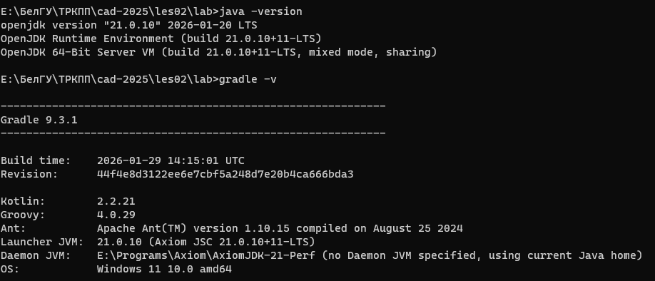
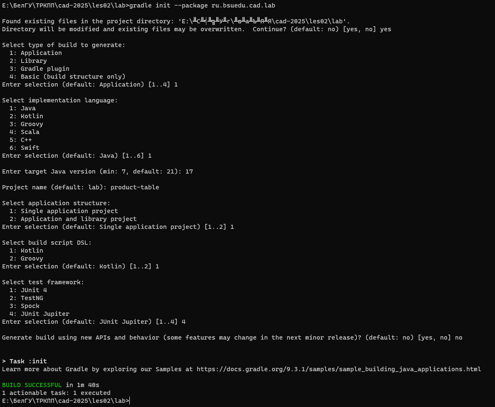
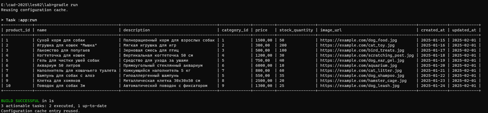

# Отчет о лабораторной работе №1

## Цель работы
В данной работе необходимо создать каркас приложения и разобраться с конфигурированием Spring приложений на основе Java-классов. Также вы напишите загрузчик CSV файлов который нам понадобится в дальнейшем.

## Выполнение работы

**Скачал и установил Axiom Standard JDK 21.0.10. Скачал и установил Gradle 9.3.1.**


**С помощью Gradle, в директории les02/lab создал проект вид Java Applications, со следующими настройками:**


**Добавил в свой проект библиотеку org.springframework:spring-context:6.2.2, путем добавления следующих строк в блок dependencies:**

```kotlin
// Source: https://mvnrepository.com/artifact/org.springframework/spring-context 
implementation("org.springframework:spring-context:6.2.2")
```

---


**Реализовал приложение удовлетворяющее следующим требованиям:**
- Приложение должно представлять собой консольное приложение разработанное с помощью фреймворка Spring и конфигурируемое
с помощью Java-конфигурации.
- Приложение должно читать данные о товарах для магазина из csv-файла и выводить его в консоль в виде таблицы.

**где,**
`Reader, ResourceFileReader` - класс читающий данные из csv-файла;
`Parser, CSVParser` - класс парсер CSV файла;
`ProductProvider, ConcreteProductProvider` - класс предоставляющий список товаров;
`Renderer, ConsoleTableRenderer` - класс выводящий список товаров в консоль в виде таблицы;
`Product` - класс описывающий сущность "Товар"

**CSV-файл располагается в директории src/main/resources моего приложения.**

---

**В начале, были созданы все интерфейсы с сигнатурами основных методов, и добавлены в папку intfs, их код представлен ниже:**

```java
// Reader.java
package ru.bsuedu.cad.lab.intfs;

public interface Reader {
    public String read();
}
```

```java
// Parser.java
package ru.bsuedu.cad.lab.intfs;

import java.util.ArrayList;
import ru.bsuedu.cad.lab.Product;


public interface Parser {
    public ArrayList<Product> parse(String str);
}
```

```java
// ProductProvider.java
package ru.bsuedu.cad.lab.intfs;

import ru.bsuedu.cad.lab.Product;
import java.util.ArrayList;


public interface ProductProvider {
    public ArrayList<Product> getProducts();
}
```

```java
// Renderer.java
package ru.bsuedu.cad.lab.intfs;


public interface Renderer {
    void render();
}
```

---


**Далее, был создан класс Product, с публичными полями и конструктором для их инициализации, его код представлен ниже:**

```java
// Product.java
package ru.bsuedu.cad.lab;

import java.math.*;
import java.util.Date;


public class Product {
    public long productId;
    public String name;
    public String description;
    public int categoryId;
    public BigDecimal price;
    public int stockQuantity;
    public String imageUrl;
    public Date createdAt;
    public Date updatedAt;

    public Product(long productId, String name, String description, int categoryId, 
        BigDecimal price, int stockQuantity, String imageUrl, Date createdAt, Date updatedAt) {
        this.productId = productId;
        this.name = name;
        this.description = description;
        this.categoryId = categoryId;
        this.price = price;
        this.stockQuantity = stockQuantity;
        this.imageUrl = imageUrl;
        this.createdAt = createdAt;
        this.updatedAt = updatedAt;
    }
}
```

**Затем, был создан функциональный интерфейс `ThrowingParser`, который используется для универсальной функции парсинга в классе `CSVParser`, его код представлен ниже:**

```java
// ThrowingParser.java
package ru.bsuedu.cad.lab.intfs;


@FunctionalInterface
public interface ThrowingParser<T> {
    T parse(String value) throws Exception;
}
```

---

**Также, был создан класс DataProcessingException, который расширяет базовый класс RuntimeException, и представляет собственный тип исключений, которые могут возникать в процессе обработки данных, его код представлен ниже:**

```java
// DataProcessingException.java
package ru.bsuedu.cad.lab;


public class DataProcessingException extends RuntimeException {
     public DataProcessingException(String message) {
        super(message);
    }

    public DataProcessingException(String message, Throwable cause) {
        super(message, cause);
    }
}
```

---

**Потом, были созданы реализации описанных ранее интерфейсов, которые содержат основную логику.**

Класс `ResourceFileReader` содержит статическую константу с названием считываемого ресурса, и в методе `read()` с использованием конструкции `try-resources` пробует создать входной поток, путем получения ресурса из папки по имени, если этого сделать не удалось, то выбрасывается исключение, если ресурс успешно открылся, то происходит его считывание в массив байтов, а затем создается и возвращается строка из байтов в нужной кодировке. Код класса представлен ниже:

```java
// ResourceFileReader.java
package ru.bsuedu.cad.lab.impls;

import java.io.IOException;
import java.io.InputStream;
import java.nio.charset.StandardCharsets;

import ru.bsuedu.cad.lab.App;
import ru.bsuedu.cad.lab.intfs.Reader;
import ru.bsuedu.cad.lab.DataProcessingException;


public class ResourceFileReader implements Reader {

    private static final String RESOURCE_PATH = "/product.csv";


    @Override
    public String read() {

        try (InputStream is = App.class.getResourceAsStream(RESOURCE_PATH)) {
            if (is == null) {
                throw new DataProcessingException("Resource not found: " + RESOURCE_PATH);
            }
            
            byte[] bytes = is.readAllBytes();
            return new String(bytes, StandardCharsets.UTF_8);            
        } catch (IOException e) {
            throw new DataProcessingException("Failed to read resource: " + RESOURCE_PATH, e);
        }
    }
}
```

**Класс `CSVParser` содержит статическую константу в виде массива строк с требуемыми заголовками, в его методе `parse()` происходит проверка переданного текста файла, если он нулевой, то выбрасывается исключение, иначе создаётся пустой список продуктов. Затем проверяется текст на пустоту, если это так, то возвращается пустой список, иначе переданный текст разделяется на строки и заносится в массив строк, у которого затем проверяется длина, и, если она нулевая, то также возвращается пустой список. В массив строк заносятся заголовки из первой строки переданного текста, далее собирается словарь из названия столбца и его индекса, затем происходит их проверка на соответсвие константе, если столбцы из файла не соответствуют ожидаемым, то выбрасывается исключение. Если заголовки прошли проверку, то создаётся formatter для даты в требуемом формате. Затем запускается цикл по ранее полученным из текста строкам, в котором выбирается текущая строка из массива, затем проверяется на пустоту, если пустая, то пропускается итерация, затем строка разбивается на колонки и сохраняется номер следующей строки. После из полученной строки с помощью универсальной функции парсинга и оберток для различных типов, происходит получение всех необходимых полей продукта, а затем создаётся и добавляется этот продукт в список. Код класса представлен ниже:** 

```java
// CSVParser.java
package ru.bsuedu.cad.lab.impls;

import java.math.BigDecimal;
import java.text.SimpleDateFormat;
import java.util.ArrayList;
import java.util.Date;
import java.util.HashMap;
import java.util.Locale;
import java.util.Map;

import ru.bsuedu.cad.lab.Product;
import ru.bsuedu.cad.lab.intfs.Parser;
import ru.bsuedu.cad.lab.intfs.ThrowingParser;
import ru.bsuedu.cad.lab.DataProcessingException;


public class CSVParser implements Parser {

    private static final String[] REQUIRED_COLUMNS = {
            "product_id",
            "name",
            "description",
            "category_id",
            "price",
            "stock_quantity",
            "image_url",
            "created_at",
            "updated_at"
    };
    

    @Override
    public ArrayList<Product> parse(String text) {
        if (text == null)
            throw new DataProcessingException("CSV text is null");

        ArrayList<Product> products = new ArrayList<>();
        if (text.isBlank()) {
            return products;
        }

        String[] lines = text.split("\\R");
        if (lines.length == 0)
            return products;

        String[] headerCols = lines[0].trim().split(",", -1);
        Map<String, Integer> headerIndex = buildHeaderIndex(headerCols);

        validateRequiredColumns(headerIndex);

        SimpleDateFormat formatter = new SimpleDateFormat("yyyy-MM-dd", Locale.ROOT);

        for (int i = 1; i < lines.length; i++) {
            String line = lines[i].trim();
            if (line.isEmpty()) {
                continue;
            }

            String[] cols = line.split(",", -1);
            int lineNumber = i + 1;

            long productId = parseLong(getValue(cols, headerIndex, "product_id"), lineNumber, "product_id");
            String name = getValue(cols, headerIndex, "name");
            String description = getValue(cols, headerIndex, "description");
            int categoryId = parseInt(getValue(cols, headerIndex, "category_id"), lineNumber, "category_id");
            BigDecimal price = parseBigDecimal(getValue(cols, headerIndex, "price"), lineNumber, "price");
            int stockQuantity = parseInt(getValue(cols, headerIndex, "stock_quantity"), lineNumber, "stock_quantity");
            String imageUrl = getValue(cols, headerIndex, "image_url");
            Date createdAt = parseDate(getValue(cols, headerIndex, "created_at"), formatter, lineNumber, "created_at");
            Date updatedAt = parseDate(getValue(cols, headerIndex, "updated_at"), formatter, lineNumber, "updated_at");

            products.add(new Product(
                    productId,
                    name,
                    description,
                    categoryId,
                    price,
                    stockQuantity,
                    imageUrl,
                    createdAt,
                    updatedAt));
        }

        return products;
    }
    

    private Map<String, Integer> buildHeaderIndex(String[] headerCols) {
        Map<String, Integer> index = new HashMap<>();
        for (int i = 0; i < headerCols.length; i++) {
            index.put(headerCols[i].trim().toLowerCase(Locale.ROOT), i);
        }
        return index;
    }

    private void validateRequiredColumns(Map<String, Integer> headerIndex) {
        for (String col : REQUIRED_COLUMNS) {
            if (!headerIndex.containsKey(col)) {
                throw new DataProcessingException("CSV header missing required column: " + col);
            }
        }
    }

    private String getValue(String[] cols, Map<String, Integer> headerIndex, String columnName) {
        Integer idx = headerIndex.get(columnName);
        if (idx == null || idx < 0 || idx >= cols.length) {
            return "";
        }
        return cols[idx].trim();
    }

    private <T> T parseValue(
            String value,
            int lineNumber,
            String columnName,
            String typeName,
            ThrowingParser<T> parser) {
        if (value == null || value.isBlank()) {
            throw new DataProcessingException(
                    "Empty " + typeName + " value in column '" + columnName + "' at line " + lineNumber);
        }

        try {
            return parser.parse(value);
        } catch (Exception e) {
            throw new DataProcessingException(
                    "Invalid " + typeName + " in column '" + columnName + "' at line " + lineNumber + ": " + value,
                    e);
        }
    }

    private int parseInt(String value, int lineNumber, String columnName) {
        return parseValue(value, lineNumber, columnName, "integer", Integer::parseInt);
    }

    private long parseLong(String value, int lineNumber, String columnName) {
        return parseValue(value, lineNumber, columnName, "long", Long::parseLong);
    }

    private BigDecimal parseBigDecimal(String value, int lineNumber, String columnName) {
        return parseValue(value, lineNumber, columnName, "decimal", BigDecimal::new);
    }

    private Date parseDate(String value, SimpleDateFormat formatter, int lineNumber, String columnName) {
        return parseValue(value, lineNumber, columnName, "date", formatter::parse);
    }
}
```

Класс `ConcreteProductProvider` выполняет роль проводника, он содержит константные поля для `reader` и `parser`, которые инициализируются в конструкторе, т.е. используется `constructor injection`, который нужен для обязательных зависимостей, в отличии от `setter injection`. Метод `getProducts()` получает строку из `reader`, а затем получает список из `parser` по считанной строке и возвращает его. Код класса представлен ниже:

```java
// ConcreteProductProvider.java
package ru.bsuedu.cad.lab.impls;

import java.util.ArrayList;

import ru.bsuedu.cad.lab.intfs.Reader;
import ru.bsuedu.cad.lab.intfs.Parser;
import ru.bsuedu.cad.lab.Product;
import ru.bsuedu.cad.lab.intfs.ProductProvider;


public class ConcreteProductProvider implements ProductProvider{
    private final Reader reader;
    private final Parser parser;
    
    
    public ConcreteProductProvider(Reader reader, Parser parser) {
        this.reader = reader;
        this.parser = parser;
    }

    @Override
    public ArrayList<Product> getProducts() {
        String resourceContent = reader.read();
        ArrayList<Product> products = parser.parse(resourceContent); 

        return products;
    }
}
```

Класс ConsoleTableRenderer содержит констаное поле с `provider` и константное поле с массивом строк заголовков, аналогично, как в классе CSVParser, но для вывода. Здесь также используется `constructor injection` для решения зависимости. Метод `render()` получает список продуктов из `provider`, затем подсчитывается ширина каждого столбца для вывода с помощью специальной функции, которая сравнивает длину значения и заголовка, выбирая наибольшее. Затем выводится верхняя граница шапки, затем заголовок, затем нижняя граница шапки. После чего, создается цикл, проходящий по каждому продукту из списка, где форматируются и собираются в массив все поля продукта, а затем эта строка выводится, после чего выводится разделитель. Код класса представлен ниже:

```java
// ConsoleTableRenderer.java
package ru.bsuedu.cad.lab.impls;

import java.util.ArrayList;

import ru.bsuedu.cad.lab.intfs.ProductProvider;
import ru.bsuedu.cad.lab.Product;
import ru.bsuedu.cad.lab.intfs.Renderer;


public class ConsoleTableRenderer implements Renderer {

    private final ProductProvider provider;

    private final String[] headers = {
            "product_id", "name", "description", "category_id",
            "price", "stock_quantity", "image_url", "created_at", "updated_at"
        };

    
    public ConsoleTableRenderer(ProductProvider provider) {
        this.provider = provider;
    }

    @Override
    public void render() {
        final ArrayList<Product> products = provider.getProducts();

        int[] widths = calcWidths(products);

        printBorder(widths);
        printRow(headers, widths);
        printBorder(widths);

        for (Product p : products) {
            String[] row = {
                    String.valueOf(p.productId),
                    p.name,
                    p.description,
                    String.valueOf(p.categoryId),
                    String.format("%.2f", p.price),
                    String.valueOf(p.stockQuantity),
                    p.imageUrl,
                    String.format("%tF", p.createdAt),
                    String.format("%tF", p.updatedAt),
            };
            printRow(row, widths);
        }

        printBorder(widths);
    }

    private void printBorder(int[] widths) {
        StringBuilder sb = new StringBuilder();
        sb.append("+");
        for (int width : widths) {
            sb.append("-".repeat(width + 2)).append("+");
        }
        System.out.println(sb);
    }

    private void printRow(String[] values, int[] widths) {
        StringBuilder sb = new StringBuilder();
        sb.append("|");
        for (int i = 0; i < values.length; i++) {
            sb.append(" ")
              .append(String.format("%-" + widths[i] + "s", values[i]))
              .append(" |");
        }
        System.out.println(sb);
    }

    private int[] calcWidths(ArrayList<Product> products) {
        int[] widths = new int[headers.length];
        
        for (int i = 0; i < headers.length; i++) {
            widths[i] = headers[i].length();
        }

        for (Product p : products) {
            widths[0] = Math.max(widths[0], String.valueOf(p.productId).length());
            widths[1] = Math.max(widths[1], p.name.length());
            widths[2] = Math.max(widths[2], p.description.length());
            widths[3] = Math.max(widths[3], String.valueOf(p.categoryId).length());
            widths[4] = Math.max(widths[4], String.format("%.2f", p.price).length());
            widths[5] = Math.max(widths[5], String.valueOf(p.stockQuantity).length());
            widths[6] = Math.max(widths[6], p.imageUrl.length());
        }

        return widths;
    }
}
```

---

После, был создан класс `AppConfig` для *java-конфигурации* spring-приложения, который помечен атрибутом `@Configuration`, и содержит методы для получения необходимых в классах-реализациях зависимостей. Соответствующие методы, создают и возвращают объект определенного типа, и помечены атрибутом `@Bean`. Код класса представлен ниже:

```java
// AppConfig.java
package ru.bsuedu.cad.lab;

import org.springframework.context.annotation.Bean;
import org.springframework.context.annotation.Configuration;

import ru.bsuedu.cad.lab.intfs.*;
import ru.bsuedu.cad.lab.impls.*;


@Configuration
public class AppConfig {

    @Bean
    public Reader reader() {
        return new ResourceFileReader();
    }

    @Bean
    public Parser parser() {
        return new CSVParser();
    }

    @Bean
    public ProductProvider productProvider(Reader reader, Parser parser) {
        return new ConcreteProductProvider(reader, parser); //
    }

    @Bean
    public Renderer renderer(ProductProvider provider) {
        return new ConsoleTableRenderer(provider);
    }
}
```

---

В конце, был создан класс `App`, который является основным и содержит точку входа в программу. В нём создается *контекст*, используя конструкцию `try-resources`, далее, класс конфигурации содержит необходимые зависимости, контекст сканирует его, после чего мы можем их получать. В объект типа `Renderer` получаем `bean`, после чего вызываем его метод `render()` для вывода на экран. Блок `catch`, отлавливает все исходящие с нижних классов исключения, выводит соответствующую ошибку, трассировку стека, и завершает приложение с кодом *1*. Код класса представлен ниже:

```java
// App.java
/*
This source file was generated by the Gradle 'init' task
 */
package ru.bsuedu.cad.lab;

import ru.bsuedu.cad.lab.intfs.Renderer;

import org.springframework.context.annotation.AnnotationConfigApplicationContext;


public class App {
    public static void main(String[] args) {

        try (AnnotationConfigApplicationContext context = 
            new AnnotationConfigApplicationContext(AppConfig.class)) {

            Renderer renderer = context.getBean(Renderer.class);
            renderer.render();
        } catch (Exception e) {
            System.err.println("Application error: " + e.getMessage());
            e.printStackTrace(System.err);
            System.exit(1);
        }
    }
}
```

---

В процессе разработки возникла проблема с отображением русских символов при выводе, что было связано с *кодировками*. CSV-файл имеет кодировку `UTF-8`, создаваемая из считанных байтов строка также создаётся в кодировке UTF-8, а вот на консоль, функция System.out.print выводила используя другую кодировку, что было решено путем добавления в файл `build.gradle.kts` задания `JavaExec`, с определением корректных кодировок:

```kotlin
tasks.withType<JavaExec>().configureEach {
    jvmArgs(
        "-Dfile.encoding=UTF-8",
        "-Dsun.stdout.encoding=UTF-8",
        "-Dsun.stderr.encoding=UTF-8"
    )
}
```

Функции используемые для проверки кодировок программы:

```java
System.out.println("stdout.encoding = " +
System.getProperty("stdout.encoding"));
System.out.println("stderr.encoding = " +
System.getProperty("stderr.encoding"));
System.out.println("stdin.encoding = " +
System.getProperty("stdin.encoding"));
System.out.println("file.encoding = " + 
System.getProperty("file.encoding"));
System.out.println("native.encoding = " +
System.getProperty("native.encoding"));
```

---

**Приложение запускается с помощью команды gradle run, выводит необходимую информацию в консоль и успешно завершается:**



---

## Выводы
В данной работе был создан каркас приложения и разобрано конфигурирование Spring приложений на основе Java-классов. Также был написан загрузчик CSV файлов.

---

## Контрольные вопросы

### 1. Spring. Определение, назначение, особенности
Spring - легковесный фреймворк(каркас) для построения приложений любого уровня на Java .

С данной формулировкой связны два важных момента.

+ Во-первых, Spring можно применять для построения любого приложения на языке Java (например, автономных, веб-приложений или корпоративных приложений на Java), в отличие от многих других фреймворков (например Apache Struts предназначенного только для создания веб-приложений.)

+ Во-вторых, "легковесный" характер Spring на самом деле обозначает не количество классов или размеры дистрибутива, а главный принцип всей философии Spring - минимальное воздействие.

Сам термин "Spring" означает разные вещи в разных контекстах. Его можно использовать для обозначения самого проекта Spring Framework, с которого все началось. Со временем другие проекты Spring были созданы поверх Spring Framework. Чаще всего, когда люди говорят "Spring", они имеют в виду все семейство проектов.

---

### 2. Проблемы ручной сборки приложений
Ручная сборка программного обеспечения — это процесс компиляции, настройки, упаковки и развертывания приложения без использования автоматизированных инструментов. Этот подход имеет ряд **существенных недостатков**, особенно в крупных проектах.

#### 1 **Человеческий фактор (ошибки и непоследовательность)**  

+ Разные разработчики могут выполнять сборку **по-разному**, что приводит к несоответствиям.  
+ Ошибки в последовательности шагов (забыли скомпилировать, добавить файлы, выполнить тесты).  
+ Ручной ввод команд может привести к опечаткам.  

#### 2️ **Долгое и неэффективное выполнение**  

+ Выполнение рутинных команд **замедляет процесс разработки**.  
+ Чем больше шагов, тем больше **времени уходит на выпуск новой версии**.  
+ При изменении конфигурации приходится повторять весь процесс заново.  

#### 3️ **Отсутствие стандартизации**  

+ Разные команды могут использовать **разные среды разработки**, что вызывает **конфликты версий**.  
+ В одном окружении приложение работает, а в другом — нет.  

#### 4️ **Сложность управления зависимостями**  

+ Если зависимости загружаются вручную, есть **риск забыть нужные библиотеки** или подключить неправильную версию.  
+ Нет контроля за версиями зависимостей между членами команды.  

#### 5️ **Отсутствие автоматического тестирования**  

+ Без автоматизированных тестов ошибки могут попадать в продакшн.  
+ При каждом изменении приходится запускать тесты **вручную**.  

#### 6️ **Проблемы с CI/CD и DevOps**  

+ Ручная сборка плохо интегрируется с **CI/CD-пайплайнами** (Jenkins, GitHub Actions, GitLab CI).  
+ Автоматизированные развертывания (Docker, Kubernetes) требуют стандартизированных процессов.  

---

### 3. Перечислите известные вам вам системы автоматической сборки. Кратно расскажите про каждую из них
#### 🟢 Ant

**Apache Ant** — это инструмент для автоматизации сборки Java-проектов, разработанный Apache Software Foundation. Он был одним из первых инструментов сборки для Java и использовался до появления Maven и Gradle.  

#### **🔹 Основные особенности:**  

+ Основан на **XML-конфигурации** (файл `build.xml`).  
+ Позволяет автоматизировать **компиляцию, тестирование, упаковку (JAR, WAR, EAR)** и развертывание.  
+ Поддерживает **кроссплатформенность**.  
+ Может быть расширен с помощью **кастомных задач** (написанных на Java).  

#### **🔹 Основные понятия:**  

+ **Project** — основной блок сборки.  
+ **Target** — отдельный шаг сборки (например, компиляция, тестирование).  
+ **Task** — конкретное действие (например, `javac`, `jar`, `copy`).  

#### **🔹 Недостатки:**  

+ XML-конфигурация громоздка.  
+ Нет автоматического управления зависимостями (в отличие от Maven и Gradle).  

### 🟢 Maven

**Apache Maven** — это мощный инструмент для **сборки**, **управления зависимостями** и **жизненным циклом проекта** в Java. Он стандартизирует процесс сборки и упрощает работу с зависимостями.  

#### **🔹 Основные возможности maven:**  

+ **Автоматическое управление зависимостями** (через `pom.xml`).  
+ **Структурированный жизненный цикл сборки** (clean, compile, test, package, install, deploy).  
+ **Поддержка плагинов** для тестирования, деплоя и других задач.  
+ **Единый формат структуры проекта (convention over configuration)**.  

#### **🔹 Основные файлы и концепции:**  

+ **`pom.xml`** – главный конфигурационный файл проекта.  
+ **Maven Central Repository** – хранилище зависимостей.  
+ **Архетипы (Archetypes)** – шаблоны проектов для быстрого старта.  


### 🟢 Gradle

**Gradle** — это современный инструмент для автоматизации сборки, управления зависимостями и развертывания проектов. Он поддерживает **Java**, **Groovy**, **Kotlin**, **Scala** и другие языки программирования, и сочетает в себе лучшие черты **Maven** и **Ant**.

#### **🔹 Основные особенности gradle:**

+ **Декларативный стиль конфигурации** с использованием **Groovy** или **Kotlin DSL**.
+ **Гибкость**: позволяет легко настроить сборку под любые нужды, включая кастомные шаги.
+ **Поддержка многоплатформенности**: работает с Java, Android, Kotlin, C/C++ и другими языками.
+ **Управление зависимостями** через **Maven Central**, **JCenter** или локальные репозитории.
+ **Инкрементальная сборка**: Gradle анализирует, какие изменения были сделаны, и собирает только измененные части проекта, что ускоряет сборку.
+ **Поддержка многомодульных проектов** и **параллельных сборок**.

#### **🔹 Плагины в Gradle:**

В **Gradle** плагины используются для расширении функциональности сборки. Плагины могут быть использованы для различных задач, таких как компиляция, тестирование, создание JAR-ов, деплой и другие. Они могут быть подключены как локально, так и через удаленные репозитории, например, через **Maven Central** или **Gradle Plugin Portal**.

Наиболее популярный способ подключать плагины в **Gradle 5+** — это использовать DSL-блок `plugins {}` в файле `build.gradle`.

---

### 4. Типовая структура Java проекта

```java
/*
 * This source file was generated by the Gradle 'init' task
 */
package ru.bsuedu.cap.hello;

import org.springframework.context.ApplicationContext;
import org.springframework.context.annotation.AnnotationConfigApplicationContext;

public class AppWithSpringJava {
    public static void main(String[] args) {
    ApplicationContext ctx = new AnnotationConfigApplicationContext(MessageConfiguration.class);
    MessageRenderer mr = ctx.getBean("renderer", MessageRenderer.class);
    mr.render();
     }
}

```

---

### 5. Типы зависимостей в Gradle

#### **`implementation`**

+ **Описание**: Это основной тип зависимости, который используется для добавления библиотек, которые необходимы для компиляции и выполнения проекта.
+ **Применение**: Зависимости, которые должны быть доступны для компиляции, но не должны быть переданы в проект, который зависит от вашего (например, библиотека не должна попасть в его classpath).
+ **Пример:**

    ```kotlin
    dependencies {
        implementation('org.springframework.boot:spring-boot-starter-web:2.5.4')
    }

##### **`api`**

+ **Описание**: Зависимости, добавленные через `api`, будут доступны не только в текущем проекте, но и во всех проектах, которые зависят от вашего проекта. Это аналогично зависимости, которая должна быть "публичной".
+ **Применение**: Используется в библиотеках или модулях, где зависимость должна быть доступна для потребителей этой библиотеки.
+ **Пример:**

    ```kotlin
    dependencies {
        api('org.springframework.boot:spring-boot-starter-data-jpa:2.5.4')
    }
    ```

##### **`compileOnly`**

+ **Описание**: Зависимости, указанные как `compileOnly`, нужны только на этапе компиляции, но они не включаются в итоговый артефакт (например, в JAR-файл).
+ **Применение**: Например, при использовании аннотаций или API, которые нужны только для компиляции, но не для выполнения.
+ **Пример:**

    ```kotlin
    dependencies {
        compileOnly('org.projectlombok:lombok:1.18.20')
    }
    ```

##### `runtimeOnly`**

+ **Описание**: Зависимости, которые нужны только на этапе выполнения, но не на этапе компиляции.
+ **Применение**: Используется для библиотек, которые необходимы только во время выполнения приложения (например, драйвера базы данных).
+ **Пример:**

    ```kotlin
    dependencies {
        runtimeOnly('mysql:mysql-connector-java:8.0.25')
    }
    ```

##### **`testImplementation`**

+ **Описание**: Зависимости, используемые только для тестирования.

+ **Применение**: Для библиотек, необходимых только для юнит-тестов, интеграционных тестов и других видов тестирования.
+ **Пример:**

    ```kotlin
    dependencies {
        testImplementation('org.junit.jupiter:junit-jupiter-api:5.7.2')
    }
    ```

##### **`testRuntimeOnly`**

+ **Описание**: Зависимости, которые нужны только во время выполнения тестов, но не для компиляции тестового кода.

+ **Применение**: Например, для зависимостей, которые требуются только в среде тестирования.
+ **Пример:**

    ```kotlin
    dependencies {
        testRuntimeOnly('org.junit.jupiter:junit-jupiter-engine:5.7.2')
    }

---

### 6. Что такое принцип инверсии управления. Для чего применяется
Инверсия управления (Inversion of Control, IoC) — это принцип программирования, при котором управление потоком выполнения программы передаётся извне, а не определяется внутри самого модуля или компонента.

Вместо того чтобы объект сам создавал свои зависимости, эти зависимости передаются ему извне (например, через конструктор, сеттеры или специальный контейнер). Это делает код более гибким, тестируемым и слабо связанным. Объект которому для работы необходимы зависимости называю *зависимым* или *целевым* (target)

Инверсия управления может быть разделена на два подтипа: *поиск зависимостей* (Dependency Lookup) и *внедрение зависимостей* (Dependency Injection).

---

### 7. В чем отличие инверсии управления от внедрения зависимостей
Инверсия управления (Inversion of Control, IoC) — это принцип программирования, а внедрение зависимостей (DI) - один из подтипов инверсии управления.

---

### 8. Принципы инверсии управления. Перечислите, кратко расскажите про каждый

### 🟢 Извлечение зависимостей (Dependency Pull)

JNDI предоставляет централизованный механизм для хранения и извлечения объектов (EJB). Зависимый объект извлекает из реестра JNDI нужный ему объект по мере необходимости.


```java

import javax.naming.InitialContext;
import javax.naming.NamingException;

public class ClientApp {
    public static void main(String[] args) {
        try {
            InitialContext ctx = new InitialContext();

            // Извлекаем EJB-компонент по имени
            GreetingService service = (GreetingService) ctx.lookup("java:global/MyApp/GreetingService");

            // Используем EJB
            System.out.println(service.greet("Alice"));
        } catch (NamingException e) {
            e.printStackTrace();
        }
    }
}
```

### 🟢 Контекстный поиск зависимостей (Contextualized Dependency Lookup)

Поиск осуществляется в контейнере, некоторым управляющем ресурсом, не только каком-то центральном реестре.


Зависимый объект реализует интерфейс

``` java
public interface ManagedComponent {
    void performLookup(Container container);
}
```

где производиться поиск зависимости в контейнере.

Контейнер предоставляет интерфейс

``` java
public interface Container {
    Object getDependency(String name);
}
```

для поиска объектов.

При запросе объекта из контейнера у запрашиваемого объекта вызывается метод performLookup.

### 🟢 Внедрение зависимостей через конструктор (Constructor Dependency Injection)

Внедрение зависимостей через конструктор происходит в том случае, когда зависимости предоставляются компоненту в его конструкторе(или нескольких конструкторах).С этой целью в компоненте объявляется один или ряд конструкторов,
получающих в качестве аргументов его зависимости, а контейнер инверсии управления передает зависимости компоненту при его получении экземпляра.

```java
class StandardOutMessageRenderer implements MessageRenderer {
    private final MessageProvider messageProvider;
    public StandardOutMessageRenderer(MessageProvider messageProvider) {
        this.messageProvider = messageProvider;
    }
}
```

### 🟢 Внедрение зависимостей через метод установки (Setter Dependency Injection)

При внедрении зависимостей через метод установки контейнер инверсии управления внедряет зависимости компонента через методы установки в стиле компонентов  JavaBeans. Методы установки компонента отражают зависимости, которыми может управлять контейнер инверсии управления.

---

### 9. Сцепление (Coupling) и связность (Cohesion)

Сцепление (Coupling) и связность (Cohesion) — это два важных понятия в программировании, которые помогают оценить качество архитектуры кода.

**Сцепление** — это мера зависимости одного модуля (или класса) от другого. Чем сильнее один модуль зависит от другого, тем выше сцепление.

+ ❌  Жесткое (Tight Coupling) — модули сильно зависят друг от друга, изменения в одном могут сломать другой.
Плохо, потому что усложняет поддержку, тестирование и расширение кода.
+ ✅  Слабое (Loose Coupling) — модули слабо зависят друг от друга и взаимодействуют через интерфейсы или абстракции.
Хорошо, так как код становится гибким и модульным.

**Связность** — это мера того, насколько логически связаны методы и данные внутри одного модуля или класса.

+ ❌  Низкая связность — класс или модуль содержит несвязанные задачи.
Плохо, потому что класс делает слишком многое и сложно поддерживается.
+ ✅  Высокая связность — все методы модуля тесно связаны друг с другом и работают с одними и теми же данными.
Хорошо, так как код становится логичным и предсказуемым.

---

### 10. Какой принцип внедрения зависимости желательно использовать и почему

Предпочтительным методом является -  внедрение зависимостей через конструктор (Constructor Injection).
Его плюсы:

1. Явная зависимость
   + Все зависимости объявляются в конструкторе, что делает код прозрачным и понятным.
   + Легко определить, какие зависимости нужны объекту для работы.

2. Невозможность работы без зависимостей
   + Объект не может быть создан без необходимых зависимостей, так как они передаются в конструктор при создании экземпляра.
   + Исключает возможность появления NullReferenceException из-за того, что зависимости не были установлены.

3. Облегчает тестирование (Unit Testing)
   + Можно легко подставлять моки или стабы при тестировании, передавая их в конструктор.
   + Упрощает использование фреймворков для тестирования, таких как Moq (C#) или Mockito (Java).

4. Уменьшение связанности (Loose Coupling)
   + Класс зависит от абстракций (интерфейсов), а не от конкретных реализаций.
   + Позволяет легко заменять реализации зависимостей, что упрощает поддержку и расширение кода.

5. Облегчает поддержку кода
   + Код становится более читаемым и понятным, так как все зависимости передаются явно.
   + Упрощает рефакторинг, так как зависимости можно заменять без изменений внутренней логики класса.

6. Совместимость с IoC-контейнерами
   + Легко интегрируется с контейнерами внедрения зависимостей (DI-контейнерами) такими как Spring, Dagger.
   + IoC-контейнер может автоматически создавать объекты и управлять их зависимостями.