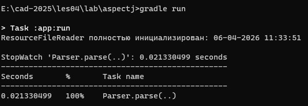
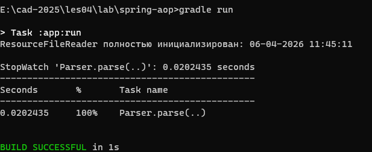
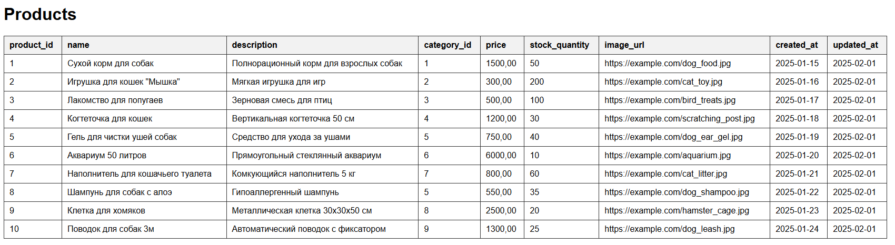

# Отчет о лабораторной работе №2

## Цель работы
В данной работе необходимо перейти на новое, более простое конфигурирование приложения с помощью аннотаций, добавить функционал по представлению таблиц в виде HTML и измерить скорость выполнения кода c помощью инструментов АОП.


## Выполнение работы

**Скопировал результат выполнения лабораторной работы №1 в директорию [/les04/lab/](/les04/lab/).**

---

**Переделал приложение так, чтобы его конфигурирование осуществлялось с помощью аннотаций @Component.**

В класс `AppConfig` была добавлена аннотация `@ComponentScan({"ru.bsuedu.cad.lab.impls", "ru.bsuedu.cad.lab.aspects"})` с двумя пакетами, в которых будут искаться компоненты, а затем были убраны все методы с аннотацией `@Bean`, т.к. Spring теперь сам ищет и создаёт нужные объекты. Код класса представлен ниже:

```java
// AppConfig.java
package ru.bsuedu.cad.lab;

import org.springframework.context.annotation.ComponentScan;
import org.springframework.context.annotation.Configuration;
import org.springframework.context.annotation.EnableAspectJAutoProxy;


@Configuration
@ComponentScan({"ru.bsuedu.cad.lab.impls", "ru.bsuedu.cad.lab.aspects"})
@EnableAspectJAutoProxy
public class AppConfig {

}
```

Во все классы, из которых нужно создавать объекты, была добавлена аннотация `@Component`.

---

**Используя аннотацию @Value и SpEL сделал так, чтобы имя файла для загрузки продуктов, приложение получало из конфигурационного файла `application.properties`. Данный файл поместил в каталог ресурсов (src/main/resources).**

Необходимое поле было помечено аннотацией `@Value("#{property.inputFileName}")` с значением из компонента *property*, который предоставляет значения.

```java
    @Value("#{property.inputFileName}")
    private String inputFileName;
```

Класс `Property` представляет собой компонент со значениями, и содержит один метод для получения имени входного файла через загрузку файла из ресурсов. Его код представлен ниже.

```java
package ru.bsuedu.cad.lab.impls;

import java.io.IOException;
import java.util.Properties;

import org.springframework.stereotype.Component;

@Component("property")
public class Property {

    public String getInputFileName() {
        Properties prop = new Properties();
        try {
            prop.load(Property.class.getClassLoader().getResourceAsStream("application.properties"));
            return prop.getProperty("inputFileName");
        } catch (IOException e) {
            e.printStackTrace();
            return "";
        }
    }
}
```

---

**Добавил еще одну имплементацию интерфейса Renderer - HTMLTableRenderer которая выводит таблицу в HTML-файл. Сделал так, чтобы при работе приложения вызывалась эта реализация, а не ConsoleTableRenderer.**

Чтобы заменить вызываемую реализацию, классам Renderer были назначены имена с использованием аннотации `@Component("name")`, а затем в классе `App` при получении объекта из контейнера используется его имя в параметре метода - `Renderer renderer = context.getBean("HTMLRenderer", Renderer.class);`.

Класс `HTMLTableRenderer` содержит поле с путем для выходного файла, которое заполняется через аннотацию `@Value` и *SpeL* из файла `application.properties`. Как и в классе ConsoleTableRenderer, имеется поле ProductProvider и поле с массивом строк для заголовков таблицы. В методе `render` происходит запись в файл начальной структуры HTML-файла, затем запись начала таблицы, строки заголовков, а затем в цикле записываются в строки таблицы значения из списка продуктов, после чего записывается конец таблицы и конечные теги HTML-файла. Код класса представлен ниже:
 
```java
// HTMLTableRenderer.java
package ru.bsuedu.cad.lab.impls;

import java.io.BufferedWriter;
import java.io.IOException;
import java.nio.charset.StandardCharsets;
import java.nio.file.Files;
import java.nio.file.Path;
import java.nio.file.StandardOpenOption;
import java.util.ArrayList;

import org.springframework.beans.factory.annotation.Autowired;
import org.springframework.beans.factory.annotation.Value;
import org.springframework.context.annotation.PropertySource;
import org.springframework.stereotype.Component;

import ru.bsuedu.cad.lab.Product;
import ru.bsuedu.cad.lab.intfs.ProductProvider;
import ru.bsuedu.cad.lab.intfs.Renderer;

@Component("HTMLRenderer")
@PropertySource("application.properties")
public class HTMLTableRenderer implements Renderer {

    @Value("#{T(java.nio.file.Path).of('${outputFilePath}')}")
    //@Value("#{property.outputFilePath}")
    private Path outputFilePath;

    private final ProductProvider provider;

    private final String[] headers = {
            "product_id", "name", "description", "category_id",
            "price", "stock_quantity", "image_url", "created_at", "updated_at"
    };

    @Autowired
    public HTMLTableRenderer(ProductProvider provider) {
        this.provider = provider;
    }

    @Override
    public void render() {
        final ArrayList<Product> products = provider.getProducts();

        try {
            Files.createDirectories(outputFilePath.getParent());

            try (BufferedWriter bw = Files.newBufferedWriter(
                    outputFilePath,
                    StandardCharsets.UTF_8,
                    StandardOpenOption.CREATE,
                    StandardOpenOption.TRUNCATE_EXISTING,
                    StandardOpenOption.WRITE)) {
                writeHTMLStart(bw);
                writeTableStart(bw);
                writeHeaderRow(bw);

                for (Product p : products) {
                    writeProductRow(bw, p);
                }

                writeTableEnd(bw);
                writeHTMLEnd(bw);

            }
        } catch (IOException e) {
            throw new RuntimeException("Не удалось записать HTML-файл: " + outputFilePath, e);
        }
    }

    private void writeHTMLStart(BufferedWriter writer) throws IOException {
        writer.write("""
                <!DOCTYPE html>
                <html lang="ru">
                <head>
                    <meta charset="UTF-8">
                    <meta name="viewport" content="width=device-width, initial-scale=1.0">
                    <title>Products</title>
                    <style>
                        body {
                            font-family: Arial, sans-serif;
                            margin: 20px;
                        }
                        table {
                            border-collapse: collapse;
                            width: 100%;
                        }
                        th, td {
                            border: 1px solid #333;
                            padding: 8px 10px;
                            text-align: left;
                            vertical-align: top;
                        }
                        th {
                            background: #f2f2f2;
                        }
                    </style>
                </head>
                <body>
                <h1>Products</h1>
                """);
    }

    private void writeTableStart(BufferedWriter writer) throws IOException {
        writer.write("<table>\n");
    }

    private void writeHeaderRow(BufferedWriter writer) throws IOException {
        writer.write("<tr>");
        for (String header : headers) {
            writer.write("<th>");
            writer.write(escapeHTML(header));
            writer.write("</th>");
        }
        writer.write("</tr>\n");
    }

    private void writeProductRow(BufferedWriter writer, Product p) throws IOException {
        writer.write("<tr>");

        writeCell(writer, String.valueOf(p.productId));
        writeCell(writer, p.name);
        writeCell(writer, p.description);
        writeCell(writer, String.valueOf(p.categoryId));
        writeCell(writer, String.format("%.2f", p.price));
        writeCell(writer, String.valueOf(p.stockQuantity));
        writeCell(writer, p.imageUrl);
        writeCell(writer, String.format("%tF", p.createdAt));
        writeCell(writer, String.format("%tF", p.updatedAt));

        writer.write("</tr>\n");
    }

    private void writeCell(BufferedWriter writer, String value) throws IOException {
        writer.write("<td>");
        writer.write(escapeHTML(value));
        writer.write("</td>");
    }

    private void writeTableEnd(BufferedWriter writer) throws IOException {
        writer.write("</table>\n");
    }

    private void writeHTMLEnd(BufferedWriter writer) throws IOException {
        writer.write("""
                </body>
                </html>
                """);
    }

    private String escapeHTML(String value) {
        if (value == null) {
            return "";
        }

        return value
                .replace("&", "&amp;")
                .replace("<", "&lt;")
                .replace(">", "&gt;")
                .replace("\"", "&quot;")
                .replace("'", "&#39;");
    }
}
```

---

**С помощью событий жизненного цикла бина, вывел в консоль дату и время, когда бин ResourceFileReader был полностью инициализирован.**

В класс `ResourceFileReader` был добавлен метод `init` из `javax.annotation.PostConstruct;`с аннотацией `@PostConstruct`, который вызывается после инициализации бина, и в нём форматируется и выводится дата и время, когда бин был полностью инициализирован:


```java
@PostConstruct
    public void init() {
        String now = LocalDateTime.now()
                .format(DateTimeFormatter.ofPattern("dd-MM-yyyy HH:mm:ss"));
        System.out.println("ResourceFileReader полностью инициализирован: " + now);
    }
```

---

**С помощью инструментов AOП замерил сколько времени тратиться на парсинг CSV файла.**

Были созданы две реализации с использованием динамического *Spring-AOP* и статического *AspectJ*.

При использовании *AspectJ* было достаточно создать всего один класс-Aspect, в котором содержится сразу *PointCut* и *Advice* для выполнения.

**Класс `AppConfig` и сам компонент `CSVParser` не нуждались в изменениях, при данном подходе. Нужно было лишь добавить аннотацию `@EnableAspectJAutoProxy` в класс-конфигурации.**   

Класс помечен аннотацией `@Aspect`, и содержит метод-advice `measureTime` с аннотацией `@Around`, которая означает, что совет будет выполняться до и после выполнения оригинального метода, в аннотацию передаётся строка-pointcut, которая выбирает необходимый метод по его названию и сигнатуре. Метод содержит параметр `ProceedingJoinPoint`, который передаётся ему автоматически при вызове, и содержит полезную информацию об оригинальном методе, а также позволяет управлять его выполнением, либо вообще пропустить его. Внутри метода создаётся Spring-объект StopWatch для измерения времени с названием измеряемого метода, затем он запускается, выполняется оригинальный метод, и если не возникло исключений, то таймер останавливается и через его же форматный метод выводится сообщение о времени выполнения. Код класса представлен ниже: 


```java
// TimingAspect.java
package ru.bsuedu.cad.lab.aspects;

import org.aspectj.lang.ProceedingJoinPoint;
import org.aspectj.lang.annotation.Around;
import org.aspectj.lang.annotation.Aspect;
import org.springframework.stereotype.Component;
import org.springframework.util.StopWatch;


@Aspect
@Component
public class TimingAspect {

    @Around("execution(* ru.bsuedu.cad.lab.impls.CSVParser.parse(..))")
    public Object measureTime(ProceedingJoinPoint joinPoint) throws Throwable {

        StopWatch sw = new StopWatch(joinPoint.getSignature().toShortString());
        try {
            sw.start(joinPoint.getSignature().toShortString());
            return joinPoint.proceed();
        } finally {
            sw.stop();
            System.out.println(sw.prettyPrint());
        }
    }
}
```

При использовании *Spring-AOP* уже нужно было создать три класса, отдельно для каждой составляющей: Advice, PointCut, Aspect.

**Класс `AppConfig` и сам компонент `CSVParser` уже пришлось изменять, при данном подходе.** 

В `CSVParser` было нужно убрать аннотацию @Component, чтобы Spring не создавал ещё один бин автоматически, который теперь создаётся в классе конфигурации вручную.

В классе `AppConfig` были добавлены методы для конфигурации Аспекта, оригинального компонента, и прокси для компонента, а также метод-сеттер для установки поля `BeanFactory`, т.к. он позволяет использовать декларативный подход и разделяет методы конфигурирования.
*Advisor* (Аспект) создаётся через статический метод класса, оригинальный компонент создаётся как обычный бин, бин для обертки-парсера создаёт внутри прокси, задаёт ему Advisor, FactoryBean, Target-бин для проксирования и возвращает приведенный к типу Parser объект полученный из прокси-объекта. Код класса представлен ниже:

```java
package ru.bsuedu.cad.lab;

import org.springframework.aop.Advisor;
import org.springframework.aop.framework.ProxyFactoryBean;
import org.springframework.beans.factory.BeanFactory;
import org.springframework.beans.factory.BeanFactoryAware;
import org.springframework.context.annotation.Bean;
import org.springframework.context.annotation.ComponentScan;
import org.springframework.context.annotation.Configuration;
import ru.bsuedu.cad.lab.intfs.*;
import ru.bsuedu.cad.lab.impls.*;
import ru.bsuedu.cad.lab.aspects.*;;


@Configuration
@ComponentScan({"ru.bsuedu.cad.lab.impls", "ru.bsuedu.cad.lab.aspects"})
public class AppConfig implements BeanFactoryAware{

    private BeanFactory beanFactory;
    

    @Bean
    public Parser parser() {
        return new CSVParser();
    }

    @Bean
    public Advisor timingAdvisor() {
        return TimingAdvisor.createTimingAdvisor();
    }

    @Bean
    public Parser proParser() {
        var proxy = new ProxyFactoryBean();
        proxy.setInterceptorNames("timingAdvisor");
        proxy.setBeanFactory(beanFactory);
        proxy.setTarget(parser());
        return (Parser) proxy.getObject();
    }

    @Override
    public void setBeanFactory(BeanFactory beanFactory) {
        this.beanFactory = beanFactory;
    }

}
```

Класс `TimingPointCut` наследуется от `NameMatchMethodPointcut` для задания точки по имени метода, и содержит всего один конструктор с вызововом встроенного метода `setMappedName()`, куда передаётся нужное имя метода для внедрения сквозной функциональности. Код класса представлен ниже:

```java
package ru.bsuedu.cad.lab.aspects;

import org.springframework.aop.support.NameMatchMethodPointcut;

public class TimingPointCut extends NameMatchMethodPointcut {
    public TimingPointCut() {
        setMappedName("parse");
    }
}
```

Класс `TimingAdvice` реализует интерфейс `MethodInterceptor`, который является аналогией аннотации `@Around` в AspectJ, и содержит метод `invoke()` с параметром `MethodInvocation`, который является аналогией параметра типа `ProceedingJoinPoint`. Функционал метода по измерению времени такой же, как и описанный ранее в AspectJ, за исключением несколько иного использования параметра. Код класса представлен ниже:

```java
package ru.bsuedu.cad.lab.aspects;

import org.aopalliance.intercept.MethodInterceptor;
import org.aopalliance.intercept.MethodInvocation;
import org.springframework.util.StopWatch;


public class TimingAdvice implements MethodInterceptor {

    @Override
    public Object invoke(MethodInvocation invocation) throws Throwable {
        String signature = invocation.getMethod().getDeclaringClass().getSimpleName()
                + "." + invocation.getMethod().getName() + "(..)";

        StopWatch sw = new StopWatch(signature);
        try {
            sw.start(signature);
            return invocation.proceed();
        } finally {
            sw.stop();
            System.out.println(sw.prettyPrint());
        }
    }
}

```

Класс `TimingAdvisor` является опциональным и был создан в учебных целях, для демонстрации того, что и при использовании Spring-AOP можно создать отдельный агрегирующий класс Аспекта, а не создавать его в классе конфигурации. Содержит один статический метод, который возвращает объект `DefaultPointcutAdvisor` с параметрами PointCut и Advice описанными ранее. Код класса представлен ниже:

```java
package ru.bsuedu.cad.lab.aspects;

import org.springframework.aop.Advisor;
import org.springframework.aop.support.DefaultPointcutAdvisor;

public class TimingAdvisor {

    public static Advisor createTimingAdvisor() {
        return new DefaultPointcutAdvisor(
                new TimingPointCut(),
                new TimingAdvice()
        );
    }
}
```

---

**Приложение запускается с помощью команды gradle run, выводит необходимую информацию в консоль и успешно завершается:**







---

## Выводы
В данной работе был осуществлен переход на новое, более простое конфигурирование приложения с помощью аннотаций, добавлен функционал по представлению таблиц в виде HTML и измерена скорость выполнения кода c помощью инструментов АОП.

---

## Контрольные вопросы

### 1. Виды конфигурирования ApplicationContext

Виды конфигурирования ApplicationContext:

1. XML-конфигурация
   + Используется файл applicationContext.xml
   + Бины определяются с помощью XML-тегов
   + Устаревший метод, но иногда используется в легаси-коде

2. Конфигурация на основе аннотаций
   + Использует аннотации @Component, @Service, @Repository, @Controller, @Bean, @Configuration
   + Требует включения Component Scan (@ComponentScan)
   + Более гибкий и современный метод

3. Конфигурация на основе Java-классов (@Configuration)
   + Использует аннотации @Configuration и @Bean
   + Позволяет более точно управлять созданием бинов

---


### 2. Стереотипные аннотации. Перечислите. Расскажите для чего используются

- `@Component` – базовая аннотация для любого Spring‑бина. Любой класс, который должен управляться Spring.
- `@Service` – аннотация для сервисного слоя, содержащего бизнес‑логику (классы с бизнес‑логикой, например `UserService`).
- `@Repository` – указывает, что класс отвечает за работу с БД; позволяет Spring автоматически обрабатывать исключения, связанные с БД (DAO‑классы).
- `@Controller` – используется в MVC‑приложениях для обработки HTTP‑запросов и возврата HTML‑страниц (классы‑контроллеры).
- `@RestController` – совмещает `@Controller` и `@ResponseBody`, используется для REST API, автоматически возвращает JSON/XML.

---


### 3. Инъекция зависимостей. Перечислите виды автоматического связывания. Расскажите про каждый из них.

- **Ручное связывание** – получить оба бина из контейнера и вручную установить зависимость (не рекомендуется).
- **Автоматическое связывание через методы установки (Setter Injection)** – Spring автоматически передаёт нужные зависимости, вызывая setter‑методы, помеченные `@Autowired`.
- **Автоматическое связывание через конструктор (Constructor Injection)** – предпочтительный способ: зависимости объявляются `final`, объект создаётся только с необходимыми зависимостями, упрощается тестирование.
- **Автоматическое связывание через поле (Field Injection)** – внедрение через аннотацию `@Autowired` непосредственно на поле.

---


### 4. Внедрение параметров. Расскажите как внедрить простые параметры в бин

Используется аннотация `@Value`. Пример:
```java
@Value("Message from provider value")
private String message;

@Value("10")
private int count;

@Value("true")
private boolean isSimple;
```

Также можно загружать свойства из внешнего файла через @PropertySource и @Value("${property.name}").

---


### 5. Внедрение параметров. Расскажите как внедрить параметры с помощью SpEL

- `@Value("#{property.name}")` – внедрение значения свойства из бина property.

- `@Value("#{property.name} - #{property.version} by #{property.author}")` – конкатенация.

- `@Value("#{T(String).join('---',property.numList)}")` – вызов статического метода.

- `@Value("#{property.fileName}")` – обращение к методу, который возвращает значение из application.properties.

---


### 6. Режимы получения бинов. Перечислите, кратко расскажите

- **Singleton** (по умолчанию) – один и тот же объект используется во всех зависимостях.

- **Prototype** – новый экземпляр бина создаётся при каждом запросе.

- **Request** (только для Web‑приложений) – один экземпляр на HTTP‑запрос.

- **Session** (только для Web‑приложений) – один экземпляр на HTTP‑сессию.

- **Application** (только для Web‑приложений) – один экземпляр на весь ServletContext (приложение).

---


### 7. Жизненный цикл бинов

1. Создание экземпляра бина – Spring создаёт объект и загружает его в контекст.

2. Внедрение зависимостей (DI) – Spring находит и автоматически внедряет зависимости.

3. Вызов методов инициализации – например, @PostConstruct (а также afterPropertiesSet() из InitializingBean).

4. Использование бина в приложении – объект готов к работе.

5. Вызов методов уничтожения – например, @PreDestroy (и destroy() из DisposableBean).

6. Удаление бина из контейнера.

---


### 8. Что такое АОП? Основные понятия AOP

Аспектно-ориентированное программирование (AOP, Aspect-Oriented Programming) — это парадигма программирования, которая позволяет отделять сквозную функциональность (cross-cutting concerns) от основной бизнес-логики.

+ Сквозная функциональность — это код, который затрагивает несколько модулей системы (например, логирование, транзакции, обработка ошибок).
+ Без AOP код повторяется в разных классах, что приводит к дублированию и затрудняет поддержку.
+ С AOP такие функции можно вынести в отдельные аспекты, что упрощает код и делает его более читаемым.

AOP в Spring применяется для:

+ **[Логирования (Logging)](https://www.baeldung.com/spring-aspect-oriented-programming-logging)** - позволяет автоматически записывать информацию о выполнении программы (например, вызовы методов, исключения, время выполнения)
+ **[Управления транзакциями (Transaction Management)](https://habr.com/ru/articles/532000/)** - используется в системах с базами данных, чтобы гарантировать целостность данных.
+ **[Обработки исключений (Exception Handling)](https://medium.com/m/global-identity-2?redirectUrl=https%3A%2F%2Ffaun.pub%2Fjava-23-springboot-3-3-4-aop-exception-handling-part-2-e6adc86c8a26)** - глобальная обработка ошибок без дублирования код, перехват исключений и запись их в лог-файл.
+ **Кэширования (Caching)** - улучшает производительность, сохраняя результаты вычислений для повторного использования, например, кэширование результата выполнения метода, чтобы не пересчитывать его заново.
+ **Безопасности (Security)** - обеспечивает контроль доступа к методам и данным, например, проверка аутентификации и авторизации перед выполнением метода.

Как и в большинстве других технологий, в АОП имеется свой особый ряд понятий
и терминов.

+ **Join Point (точка соединения)** -  определенная точка во время выполнения приложения. Характерными примерами точек соединения служат вызов метода, обращение к методу, инициализация класса и получение экземпляра объекта. Точки соединения относятся к базовым понятиям АОП и определяют места в приложении, где можно вставлять дополнительную логику средствами и dАОП.
  
+ **Advice (совет)** - фрагмент кода, который должен выполняться в определенной точке соединения. Существует много разновидностей советов, например: before (предшествующий совет), когда он выполняется до точки соединения, after (последующий совет), когда он выполняется после точки соединения.
+ **Point cut (срез)** - это совокупность точек соединения, предназначенная для определения момента, когда следует выполнить совет. Создавая срезы, можно приобрести очень точный контроль над тем, как совет применять к компонентам приложения. Как упоминалось ранее, типичной точкой соединения служит вызов метода или же вызовы всех методов из отдельного класса. Зачастую между срезами можно устанавливать сложные отношения, чтобы наложить дополнительное ограничение на момент, å когда следует выполнить совет.
+ **Aspect (аспект)**- это сочетание совета и срезов, инкапсулированных в классе. Такое сочетание приводит в итоге к определению логики, которую следует внедрить в приложение, а также тех мест, где она должна выполняться.
+ **Target (цель)** - это объект, поток исполнения которого изменяется каким-нибудь процессом АОП. Такой  объект часто называют - advised object.
+ **Weaving (связывание)** - это процесс вставки аспекта в определенное место прикладного кода.

---


### 9. Типы АОП в Spring

В аспектно-ориентированном программировании (АОП) существуют два основных способа реализации: динамическая (runtime) и статическая (compile-time или load-time).

+ Динамическая реализация (Runtime Weaving)

    Это подход, при котором аспекты применяются во время выполнения программы. Для этого используется прокси-объект (Proxy Pattern), который оборачивает целевой объект и добавляет сквозную функциональность (аспекты). Программа загружается без изменений, а аспекты внедряются во время выполнения.

    Данный подход позволяет достичь большей гибкости, аспекты можно включать или выключать без перекомпиляции кода, аспекты можно применять в зависимости от окружения. Однако за гибкость приходится платить производительностью. 

    Данный подход реализован в библиотеке Spring AOP, которая является частью фреймворка Spring. Динамической связывание работает с использование двух технологий JDK Dynamic Proxy или CGLIB Proxy. JDK Dynamic Proxy применяется для классов которые реализуют какие либо интерфейсы, CGLIB Proxy применяется для классов которые интерфейсы не реализуют.

+ Статическая реализация (Compile-Time или Load-Time Weaving)

    Этот подход предполагает внедрение аспектов во время компиляции или загрузки классов в JVM. Для этого код модифицируется еще до выполнения программы, на этапе компиляции. Применяются инструменты, такие как AspectJ Compiler (ajc), чтобы внедрить аспекты в байт-код. AspectJ также поддерживает подстановку аспектов при загрузке классов (Load-Time Weaving) заменяя стандартный загрузчик классов. 

    Данный подходи позволяет достичь более высокой производительности, так как аспекты уже встроены в код. Однако для любого изменения требуется перекомпиляция кода.

---


### 10. Виды Advice

Advice (Советы) в Spring AOP являются реализациями интерфейса Advice

| Наименование             | Класс                    | Описание |
|--------------------------|--------------------------------------|--------------------|
| **Before Advice**        | `org.springframework.aop.MethodBeforeAdvice` | Выполняется перед вызовом целевого метода. Используется для логирования, валидации параметров, аутентификации и других предварительных действий. |
| **After Returning Advice** | `org.springframework.aop.AfterReturningAdvice` | Выполняется после успешного завершения метода. Может использоваться для логирования результата или обработки возвращаемого значения. |
| **Throws Advice**        | `org.springframework.aop.ThrowsAdvice` | Вызывается при возникновении исключения в целевом методе. Используется для логирования ошибок и обработки исключений. |
| **Around Advice**        | `org.aopalliance.intercept.MethodInterceptor` | Полностью перехватывает вызов метода, позволяя выполнить код до, после или вместо метода. Используется для кэширования, измерения времени выполнения и управления транзакциями. |


Пример реализации Around Advice, реализация интерфейса org.springframework.aop.AfterReturningAdvice.

```java
public class NarutoficatorAdvice implements AfterReturningAdvice{

    @Override
    public void afterReturning(Object returnValue, Method method, Object[] args, Object target) throws Throwable {
        System.out.println(", とってばよ！");
    }    
}
```

Для того чтобы использовать полученный Advice, необходимо добавить его к Proxy объекту.

``` java
@Configuration
@ComponentScan(basePackages = "ru.bsuedu.cad.demo")
public class AppConfiguration {
    
 @Bean
 public Person person(){


    var proxy = new ProxyFactory();
    var person = new Person();
    var advice = new NarutoficatorAdvice();
    proxy.addAdvice(advice);
    proxy.setTarget(person);

    return (Person)proxy.getProxy();
 }
}
```

---


### 11. Виды Point Cut

Срез представляет собой реализацию  интерфейса Pointcut .

```java
public interface Pointcut {
    ClassFilter getClassFilter ();
    MethodMatcher getMethodMatcher();
}
```
Основные реализации интерфейса Pointcut.

| Класс реализации                             | Описание |
|----------------------------------------------|----------|
| **`org.springframework.aop.support.NameMatchMethodPointcut`** | Сопоставляет методы по имени. Позволяет указывать полное имя метода или использовать шаблоны с `*` (например, `get*`). |
| **`org.springframework.aop.support.JdkRegexpMethodPointcut`** | Использует регулярные выражения для фильтрации методов. Позволяет задавать сложные шаблоны для имен методов. |
| **`org.springframework.aop.support.StaticMethodMatcherPointcut`** | Позволяет определить точку среза (`Pointcut`), которая проверяется только один раз во время загрузки класса (статический анализ). |
| **`org.springframework.aop.support.DynamicMethodMatcherPointcut`** | Выполняет проверку `Pointcut` во время выполнения (динамический анализ). Позволяет применять фильтрацию в зависимости от параметров метода. |
| **`org.springframework.aop.support.AspectJExpressionPointcut`** | Использует выражения **AspectJ** для более гибкого определения точек среза (например, `execution(* com.example.service.*.*(..))`). |
| **`org.springframework.aop.support.ControlFlowPointcut`** | Позволяет применять `Pointcut`, если вызов метода происходит в определенном контексте выполнения (например, если метод вызван из другого метода). |
| **`org.springframework.aop.support.ComposablePointcut`** | Позволяет комбинировать несколько `Pointcut` с помощью логических операций (`AND`, `OR`, `NOT`). |


Пример реализации NameMatchMethodPointcut

``` java
public class NarutoficatorPointCut  extends NameMatchMethodPointcut{

  @Override 
 public boolean matches(Method method, Class<?> targetClass) {
  return "scream".equals(method.getName());
 }
}

```

---


### 12. Чем Spring AOP отличается от AspectJ

**Spring AOP** – динамическая (runtime) реализация на основе прокси (JDK Dynamic Proxy или CGLIB). Работает только для публичных методов Spring‑бинов. Не требует отдельной компиляции, аспекты внедряются во время выполнения. Менее производителен, но проще в настройке.

**AspectJ** – статическая (compile‑time / load‑time) реализация, работает на уровне байт‑кода. Может перехватывать вызовы конструкторов, статические методы, изменения полей и т.д. Требует отдельной компиляции (ajc) или специального загрузчика классов. Обеспечивает более высокую производительность и бо́льшую гибкость, но сложнее в использовании. Spring AOP может использовать аннотации AspectJ, но при этом всё равно применяются прокси, а не байт‑код.

