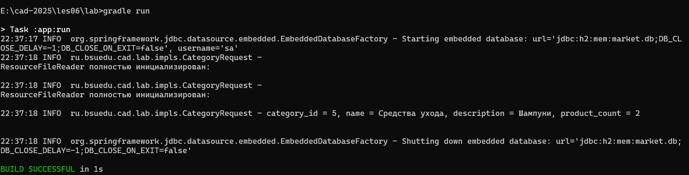

# Отчет о лабораторной работе №4

## Цель работы
В данной работе перейдем с использования Spring JDBC на использование ORM Hibernate и Spring Data. Расширим наше приложение новыми сущностями и приведем структуру приложения в соответствие со "слоистой архитектурой".


## Выполнение работы

**Скопировал результат выполнения лабораторной работы №3 в директорию [/les08/lab/](/les08/lab/).**

---

**Создал DataSource соответствующий следующим требованиям:**
   1. Должна использоваться база данных H2;
   2. Для реализации DataSource необходимо использовать библиотеку HikariCP, а именно HikariDataSource;
   3. Для работы с базой данных должна использоваться библиотека HIbernate, использующая технологию ORM;
   4. Схема данных должна создаваться автоматически на основании JPA сущностей.

Конфигурационный файл был разделен на две части, в одном из которых создаётся DataSource и Reader's, а во втором все необходимые JPA компоненты.

Класс `AppConfigBasic`, как было сказано ранее, содержит методы для создания DataSource, а именно HikariDataSource, с заданием необходимых свойств, которые внедряются через аннотацию @Value. Также, в нём определены методы создания различных Reader's для чтения всех имеющихся CSV-файлов. Код класса представлен ниже:

```java
// AppConfigBasic.java
package ru.bsuedu.cad.lab.config;

import javax.sql.DataSource;

import org.springframework.beans.factory.annotation.Value;
import org.springframework.context.annotation.Bean;
import org.springframework.context.annotation.ComponentScan;
import org.springframework.context.annotation.Configuration;
import org.springframework.context.annotation.PropertySource;

import com.zaxxer.hikari.HikariDataSource;

import ru.bsuedu.cad.lab.io.ResourceFileReader;
import ru.bsuedu.cad.lab.io.Reader;

@Configuration
@ComponentScan("ru.bsuedu.cad.lab")
@PropertySource("classpath:jdbc.properties")
public class AppConfigBasic {

    @Value("${jdbc.driverClassName}")
    private String driverClassName;
    @Value("${jdbc.url}")
    private String url;
    @Value("${jdbc.username}")
    private String username;
    @Value("${jdbc.password}")
    private String password;
    @Value("${jdbc.maxPoolSize}")
    private Integer maxPoolSize;

   
    @Bean(destroyMethod = "close")
    public DataSource dataSource() {
        HikariDataSource hDataSource = new HikariDataSource();
        hDataSource.setJdbcUrl(url);
        hDataSource.setUsername(username);
        hDataSource.setPassword(password);
        hDataSource.setDriverClassName(driverClassName);
        hDataSource.setMaximumPoolSize(maxPoolSize);

        return hDataSource;
    }

    @Bean("productReader")
    public Reader productReader(@Value("#{property.productInputFileName}") String fileName) {
        return new ResourceFileReader(fileName);
    }

    @Bean("categoryReader")
    public Reader categoryReader(@Value("#{property.categoryInputFileName}") String fileName) {
        return new ResourceFileReader(fileName);
    }

    @Bean("customerReader")
    public Reader customerReader(@Value("#{property.customerInputFileName}") String fileName) {
        return new ResourceFileReader(fileName);
    }
}
```

Класс `AppConfigJpa` содержит методы для создания `EntityManager` и `TransactionManager`. Для автоматического создания схемы данных на основании JPA-сущностей используется аннотация `@EnableJpaRepositories(basePackages = "ru.bsuedu.cad.lab.repository")`, с заданием пакета, в котором эти сущности определены. Для работы с транзакциями используется аннотация `@EnableTransactionManagement`. EntityManager создаётся с помощью `LocalContainerEntityManagerFactoryBean`, затем ему задаётся созданный ранее DataSource, создаётся `HibernateJpaVendorAdapter`, для работы с базой данных через *ORM Hibernate*, который тоже добавляется, затем определяются дополнительные JPA-свойства и тоже задаются менеджеру. Также имеется метод для создания менеджера транзакций. Код класса представлен ниже:

```java
// AppConfigJpa.java
package ru.bsuedu.cad.lab.config;

import java.util.Properties;

import javax.sql.DataSource;

import org.springframework.beans.factory.annotation.Autowired;
import org.springframework.context.annotation.Bean;
import org.springframework.context.annotation.ComponentScan;
import org.springframework.context.annotation.Configuration;
import org.springframework.context.annotation.Import;
import org.springframework.data.jpa.repository.config.EnableJpaRepositories;
import org.hibernate.cfg.Environment;
import org.springframework.transaction.PlatformTransactionManager;
import org.springframework.transaction.annotation.EnableTransactionManagement;

import jakarta.persistence.EntityManagerFactory;

import org.springframework.orm.jpa.JpaTransactionManager;
import org.springframework.orm.jpa.LocalContainerEntityManagerFactoryBean;
import org.springframework.orm.jpa.vendor.HibernateJpaVendorAdapter;

@Import(AppConfigBasic.class)
@Configuration
@ComponentScan(basePackages = "ru.bsuedu.cad.lab")
@EnableJpaRepositories(basePackages = "ru.bsuedu.cad.lab.repository")
@EnableTransactionManagement
public class AppConfigJpa {

    @Autowired
    DataSource dataSource;

    @Bean
    public LocalContainerEntityManagerFactoryBean entityManagerFactory() {
        LocalContainerEntityManagerFactoryBean em =
        new LocalContainerEntityManagerFactoryBean();
        em.setDataSource(dataSource);
        em.setPackagesToScan("ru.bsuedu.cad.lab.entity");
    
        HibernateJpaVendorAdapter vendorAdapter = new HibernateJpaVendorAdapter();
        vendorAdapter.setShowSql(true);
        vendorAdapter.setGenerateDdl(true);
        vendorAdapter.setDatabasePlatform("org.hibernate.dialect.H2Dialect");
        em.setJpaVendorAdapter(vendorAdapter);

        // Дополнительные свойства JPA/Hibernate
        Properties properties = new Properties();
        properties.put(Environment.HBM2DDL_AUTO, "create-drop");
        properties.put(Environment.DIALECT, "org.hibernate.dialect.H2Dialect");
        properties.put(Environment.FORMAT_SQL, true);
        properties.put(Environment.USE_SQL_COMMENTS, false);
        properties.put(Environment.SHOW_SQL, true);
        properties.put(Environment.MAX_FETCH_DEPTH, 3);
        properties.put(Environment.STATEMENT_BATCH_SIZE, 10);
        properties.put(Environment.STATEMENT_FETCH_SIZE, 50);
        
        em.setJpaProperties(properties);

        return em;
    }
    
    @Bean
    public PlatformTransactionManager transactionManager(EntityManagerFactory emf) {
        return new JpaTransactionManager();
    }
}
```

---

**Структура пакетов проекта имеет следующий вид:**
- ru.bsuedu.cad.lab - основной пакет
- ru.bsuedu.cad.lab.entity - JPA сущности
- ru.bsuedu.cad.lab.repository - репозитории
- ru.bsuedu.cad.lab.service - сервисы
- ru.bsuedu.cad.lab.app - приложение
- ru.bsuedu.cad.lab.config - кофигурация
- ru.bsuedu.cad.lab.csv - работа с csv
    - ru.bsuedu.cad.lab.csv.dto - промежуточные сущности для JPA
    - ru.bsuedu.cad.lab.csv.parser - парсеры
    - ru.bsuedu.cad.lab.csv.provider - провайдеры   
- ru.bsuedu.cad.lab.io - работа с чтением файлов
- ru.bsuedu.cad.lab.renderer - работа с отрисовкой (сохранением)
- ru.bsuedu.cad.lab.util - вспомогательные утилиты

---

**В пакете ru.bsuedu.cad.lab.entity создал JPA-сущности для схемы базы данных.**

Как и сущности, использовавшиеся раньше, содержат поля и акссесоры для доступа к ним.

Для создания всех сущностей использовались необходимые поля со схемы и следующие аннотации:
- @Entity - для обозначения класса JPA-сущностью; 
- @Table(name = "") - для отображения класса в таблицу с указанием её имени в БД;
- @Id - для задания поля, как первичного ключа;
- @GeneratedValue(strategy = GenerationType.) - для автоинкремента первичного ключа с указанием стратегии генерации;
- @Column() - для обозначения поля как колонки таблицы с указанием необходимых параметров;
- @OneToMany(mappedBy = "") - для обозначения двунаправленной связи `один ко многим`, обратная сторона которой задана в поле из параметра. Не создаёт отдельную колонку в таблице;
- @ManyToOne и @JoinColumn(name = "customer_id") - для создания связи `многие к одному`, с заданием имени колонки по которой будет происходить соединение. Создаёт отдельную колонку в таблице;

Класс `Category` представляет сущность "Категория". Код класса представлен ниже:

```java
// Category.java
package ru.bsuedu.cad.lab.entity;

import java.util.ArrayList;
import java.util.List;

import jakarta.persistence.CascadeType;
import jakarta.persistence.Column;
import jakarta.persistence.Entity;
import jakarta.persistence.GeneratedValue;
import jakarta.persistence.GenerationType;
import jakarta.persistence.Id;
import jakarta.persistence.OneToMany;
import jakarta.persistence.Table;

@Entity
@Table(name = "categories")
public class Category {
    
    @Id
    @GeneratedValue(strategy = GenerationType.IDENTITY)
    @Column(name = "category_id")
    private Long categoryId;

    @Column(name = "name", nullable = false, length = 150)
    private String name;

    @Column(name = "description", nullable = true, length = 500)
    private String description;

    // Двунаправленная связь для удобства работы, отдельный столбец не создаётся
    // Т.к. одна категория может содержать много продуктов
    @OneToMany(mappedBy = "category", cascade = CascadeType.ALL)
    private List<Product> products = new ArrayList<>();


    public void setCategoryId(Long categoryId) {
        this.categoryId = categoryId;
    }

    public Long getCategoryId() {
        return categoryId;
    }

    public void setName(String name) {
        this.name = name;
    }

    public String getName() {
        return name;
    }

    public void setDescription(String description) {
        this.description = description;
    }

    public String getDescription() {
        return description;
    }

    public void setProducts(List<Product> products) {
        this.products = products;
    }

    public List<Product> getProducts() {
        return products;
    }
}
```

Класс `Customer` представляет сущность "Покупатель". Код класса представлен ниже:

```java
// Customer.java
package ru.bsuedu.cad.lab.entity;

import java.util.List;

import jakarta.persistence.CascadeType;
import jakarta.persistence.Column;
import jakarta.persistence.Entity;
import jakarta.persistence.GeneratedValue;
import jakarta.persistence.GenerationType;
import jakarta.persistence.Id;
import jakarta.persistence.OneToMany;
import jakarta.persistence.Table;

@Entity
@Table(name = "customers")
public class Customer{
    
    @Id
    @GeneratedValue(strategy = GenerationType.IDENTITY)
    @Column(name = "customer_id")
    private Long customerId;

    @Column(name = "name", nullable = false, length = 150)
    private String name;

    @Column(name = "email", unique = true, nullable = false, length = 150)
    private String email;

    @Column(name = "phone", nullable = false, length = 50)
    private String phone;

    @Column(name = "address", nullable = false, length = 150)
    private String address;

    // Двунаправленная связь
    // Т.к. один покупатель может оформлять много заказов
    @OneToMany(mappedBy = "customer", cascade = CascadeType.ALL)
    private List<Order> orders;
    

    public void setCustomerId(Long customerId) {
        this.customerId = customerId;
    }

    public Long getCustomerId() {
        return customerId;
    }
    
    public void setName(String name) {
        this.name = name;
    }

    public String getName() {
        return name;
    }

    public void setEmail(String email) {
        this.email = email;
    }

    public String getEmail() {
        return email;
    }

    public void setPhone(String phone) {
        this.phone = phone;
    }

    public String getPhone() {
        return phone;
    }
    
    public void setAddress(String address) {
        this.address = address;
    }

    public String getAddress() {
        return address;
    }

    public void setOrders(List<Order> orders) {
        this.orders = orders;
    }

    public List<Order> getOrders() {
        return orders;
    }
}
```

Класс `Order` представляет сущность "Заказ". Код класса представлен ниже:

```java
// Order.java
package ru.bsuedu.cad.lab.entity;

import java.math.BigDecimal;
import java.time.LocalDateTime;
import java.util.ArrayList;
import java.util.List;

import jakarta.persistence.CascadeType;
import jakarta.persistence.Column;
import jakarta.persistence.Entity;
import jakarta.persistence.GeneratedValue;
import jakarta.persistence.GenerationType;
import jakarta.persistence.Id;
import jakarta.persistence.JoinColumn;
import jakarta.persistence.ManyToOne;
import jakarta.persistence.OneToMany;
import jakarta.persistence.Table;

@Entity
@Table(name = "orders")
public class Order{

    @Id
    @GeneratedValue(strategy = GenerationType.IDENTITY)
    @Column(name = "order_id")
    private Long orderId;
    
    // Т.к. много заказов может принадлежать одному покупателю (FK) 
    @ManyToOne
    @JoinColumn(name = "customer_id", unique = false, nullable = false)
    private Customer customer;
    
    @Column(name = "order_date", unique = false, nullable = false)
    private LocalDateTime orderDate;

    @Column(name = "total_price", unique = false, nullable = false)
    private BigDecimal totalPrice;
    
    @Column(name = "status", unique = false, nullable = false)
    private String status;

    @Column(name = "shipping_address", unique = false, nullable = false)
    private String shippingAddress;

    // Двунаправленная связь
    // Т.к. один заказ содержит много строк заказа
    @OneToMany(mappedBy = "order", cascade = CascadeType.ALL, orphanRemoval = true)
    private List<OrderDetail> orderDetails = new ArrayList<>();


    public void setOrderId(Long orderId) {
        this.orderId = orderId;
    }

    public Long getOrderId() {
        return orderId;
    }

    public void setCustomer(Customer customer) {
        this.customer = customer;
    }
    
    public Customer getCustomer() {
        return customer;
    }

    public void setOrderDate(LocalDateTime orderDate) {
        this.orderDate = orderDate;
    }

    public LocalDateTime getOrderDate() {
        return orderDate;
    }

    public void setTotalPrice(BigDecimal totalPrice) {
        this.totalPrice = totalPrice;
    }

    public BigDecimal getTotalPrice() {
        return totalPrice;
    }

    public void setStatus(String status) {
        this.status = status;
    }

    public String getStatus() {
        return status;
    }

    public void setShippingAddress(String shippingAddress) {
        this.shippingAddress = shippingAddress;
    }

    public String getShippingAddress() {
        return shippingAddress;
    }

    public void setOrderDetails(List<OrderDetail> orderDetails) {
        this.orderDetails = orderDetails;
    }

    public List<OrderDetail> getOrderDetails() {
        return orderDetails;
    }
}
```

Класс `OrderDetail` представляет сущность "Строки заказа", и используется для избежания связи "многие ко многим", являясь промежуточной таблицей. Код класса представлен ниже:

```java
// OrderDetail.java
package ru.bsuedu.cad.lab.entity;

import java.math.BigDecimal;

import jakarta.persistence.Column;
import jakarta.persistence.Entity;
import jakarta.persistence.GeneratedValue;
import jakarta.persistence.GenerationType;
import jakarta.persistence.Id;
import jakarta.persistence.JoinColumn;
import jakarta.persistence.ManyToOne;
import jakarta.persistence.Table;

@Entity
@Table(name = "order_details")
public class OrderDetail {

    @Id
    @GeneratedValue(strategy = GenerationType.IDENTITY)
    @Column(name = "order_detail_id")
    private Long orderDetailId;

    // Каждая строка заказа принадлежит одному заказу.
    // Один заказ может содержать много строк заказа. (FK)
    @ManyToOne(optional = false)
    @JoinColumn(name = "order_id", nullable = false)
    private Order order;

    // Каждая строка заказа ссылается на один товар.
    // Один товар может встречаться во многих строках заказа. (FK)
    @ManyToOne(optional = false)
    @JoinColumn(name = "product_id", nullable = false)
    private Product product;

    @Column(name = "quantity", nullable = false)
    private Integer quantity;

    @Column(name = "price", nullable = false, precision = 12, scale = 2)
    private BigDecimal price;

    public void setOrderDetailId(Long orderDetailId) {
        this.orderDetailId = orderDetailId;
    }

    public Long getOrderDetailId() {
        return orderDetailId;
    }

    public void setOrder(Order order) {
        this.order = order;
    }

    public Order getOrder() {
        return order;
    }

    public void setProduct(Product product) {
        this.product = product;
    }

    public Product getProduct() {
        return product;
    }

    public void setQuantity(Integer quantity) {
        this.quantity = quantity;
    }

    public Integer getQuantity() {
        return quantity;
    }

    public void setPrice(BigDecimal price) {
        this.price = price;
    }

    public BigDecimal getPrice() {
        return price;
    }
}
```

Класс `Product` представляет сущность "Продукт". Содержит метод с аннотацией `@PrePersist`, который вызывается перед созданием (вставкой) сущности, в котором автоматически задаются поля с датами создания и обновления, и метод с аннотацией `@PreUpdate`, который вызывается перед обновлением сущности, и также автоматически задаёт поле с датой обновления. Код класса представлен ниже:

```java
// Product.java
package ru.bsuedu.cad.lab.entity;

import java.math.BigDecimal;
import java.time.LocalDate;
import java.util.ArrayList;
import java.util.List;

import jakarta.persistence.CascadeType;
import jakarta.persistence.Column;
import jakarta.persistence.Entity;
import jakarta.persistence.GeneratedValue;
import jakarta.persistence.GenerationType;
import jakarta.persistence.Id;
import jakarta.persistence.JoinColumn;
import jakarta.persistence.ManyToOne;
import jakarta.persistence.OneToMany;
import jakarta.persistence.PrePersist;
import jakarta.persistence.PreUpdate;
import jakarta.persistence.Table;

@Entity
@Table(name = "products")
public class Product {
    
    @Id
    @GeneratedValue(strategy = GenerationType.IDENTITY)
    @Column(name = "product_id")
    private Long productId;

    @Column(name = "name", nullable = false, length = 150)
    private String name;

    @Column(name = "description", length = 500)
    private String description;

    // Т.к. много продуктов могут принадлежать одной категории (FK)
    @ManyToOne(optional = false)
    @JoinColumn(name = "category_id", nullable = false)
    private Category category;

    @Column(name = "price", nullable = false, precision = 12, scale = 2)
    private BigDecimal price;
    
    @Column(name = "stock_quantity", nullable = false)
    private Integer stockQuantity;

    @Column(name = "image_url", length = 500)
    private String imageUrl;

    @Column(name = "created_at")
    private LocalDate createdAt;

    @Column(name = "updated_at")
    private LocalDate updatedAt;

    // Двунаправленная связь
    // Т.к. один продукт может быть в различных детализациях заказа
    @OneToMany(mappedBy = "product", cascade = CascadeType.ALL)
    private List<OrderDetail> orderDetails = new ArrayList<OrderDetail>();


    @PrePersist
    protected void onCreate() {
        if (createdAt == null && updatedAt == null) {
            createdAt = LocalDate.now();
            updatedAt = LocalDate.now();
        }
    }

    @PreUpdate
    protected void onUpdate() {
        updatedAt = LocalDate.now();
    }


    public void setProductId(Long productId) {
        this.productId = productId;
    }

    public Long getProductId() {
        return productId;
    }

    public void setName(String name) {
        this.name = name;
    }

    public String getName() {
        return name;
    }

    public void setDescription(String description) {
        this.description = description;
    }

    public String getDescription() {
        return description;
    }

    public void setCategory(Category category) {
        this.category = category;
    }

    public Category getCategory() {
        return category;
    }

    public void setPrice(BigDecimal price) {
        this.price = price;
    }

    public BigDecimal getPrice() {
        return price;
    }

    public void setStockQuantity(Integer stockQuantity) {
        this.stockQuantity = stockQuantity;
    }

    public Integer getStockQuantity() {
        return stockQuantity;
    }

    public void setImageUrl(String imageUrl) {
        this.imageUrl = imageUrl;
    }

    public String getImageUrl() {
        return imageUrl;
    }

    public void setCreatedAt(LocalDate createdAt) {
        this.createdAt = createdAt;
    }

    public LocalDate getCreatedAt() {
        return createdAt;
    }

    public void setUpdatedAt(LocalDate updatedAt) {
        this.updatedAt = updatedAt;
    }

    public LocalDate getUpdatedAt() {
        return updatedAt;
    }

    public void setOrderDetails(List<OrderDetail> orderDetails) {
        this.orderDetails = orderDetails;
    }

    public List<OrderDetail> getOrderDetails() {
        return orderDetails;
    }
}
```

Старые JDBC сущности были изменены в DTO (Data Transfer Object) классы, которые служат для первичного считывания из CSV-строк, и из которых впоследствии создаются JPA-сущности.

Класс `CategoryCsvRow` представляет собой старую сущность Category. Код класса представлен ниже:

```java
// CategoryCsvRow.java
package ru.bsuedu.cad.lab.csv.dto;

public class CategoryCsvRow {
    
    private Long categoryId;
    private String name;
    private String description;


    public CategoryCsvRow(Long categoryId, String name, String description) {
        this.categoryId = categoryId;
        this.name = name;
        this.description = description;
    }


    public void setCategoryId(Long categoryId) {
        this.categoryId = categoryId;
    }

    public Long getCategoryId() {
        return categoryId;
    }

    public void setName(String name) {
        this.name = name;
    }

    public String getName() {
        return name;
    }

    public void setDescription(String description) {
        this.description = description;
    }

    public String getDescription() {
        return description;
    }
}
```

Класс `CustomerCsvRow` представляет собой сущность Customer. Код класса представлен ниже:

```java
// CustomerCsvRow.java
package ru.bsuedu.cad.lab.csv.dto;

public class CustomerCsvRow {
    
    private Long customerId;
    private String name;
    private String email;
    private String phone;
    private String address;

    
    public CustomerCsvRow(Long customerId, String name, String email, String phone, String address) {
        this.customerId = customerId;
        this.name = name;
        this.email = email;
        this.phone = phone;
        this.address = address;
    }

    
    public Long getCustomerId() {
        return customerId;
    }

    public void setCustomerId(Long customerId) {
        this.customerId = customerId;
    }

    public String getName() {
        return name;
    }

    public void setName(String name) {
        this.name = name;
    }

    public String getEmail() {
        return email;
    }

    public void setEmail(String email) {
        this.email = email;
    }

    public String getPhone() {
        return phone;
    }

    public void setPhone(String phone) {
        this.phone = phone;
    }

    public String getAddress() {
        return address;
    }

    public void setAddress(String address) {
        this.address = address;
    }
}
```

Класс `ProductCsvRow` представляет собой старую сущность Product. Код класса представлен ниже:

```java
// ProductCsvRow.java
package ru.bsuedu.cad.lab.csv.dto;

import java.math.BigDecimal;
import java.time.LocalDate;

public class ProductCsvRow {
    private Long productId;
    private String name;
    private String description;
    private Long categoryId;
    private BigDecimal price;
    private int stockQuantity;
    private String imageUrl;
    private LocalDate createdAt;
    private LocalDate updatedAt;

    
    public ProductCsvRow(Long productId, String name, String description, Long categoryId, 
        BigDecimal price, int stockQuantity, String imageUrl, LocalDate createdAt, LocalDate updatedAt) {
        this.productId = productId;
        this.name = name;
        this.description = description;
        this.categoryId = categoryId;
        this.price = price;
        this.stockQuantity = stockQuantity;
        this.imageUrl = imageUrl;
        this.createdAt = createdAt;
        this.updatedAt = updatedAt;
    }

    
    public void setProductId(Long productId) {
        this.productId = productId;
    }

    public Long getProductId() {
        return productId;
    }

    public void setName(String name) {
        this.name = name;
    }

    public String getName() {
        return name;
    }

    public void setDescription(String description) {
        this.description = description;
    }

    public String getDescription() {
        return description;
    }

    public void setCategoryId(Long categoryId) {
        this.categoryId = categoryId;
    }

    public Long getCategoryId() {
        return categoryId;
    }

    public void setPrice(BigDecimal price) {
        this.price = price;
    }

    public BigDecimal getPrice() {
        return price;
    }

    public void setStockQuantity(int stockQuantity) {
        this.stockQuantity = stockQuantity;
    }

    public int getStockQuantity() {
        return stockQuantity;
    }

    public void setImageUrl(String imageUrl) {
        this.imageUrl = imageUrl;
    }

    public String getImageUrl() {
        return imageUrl;
    }

    public void setCreatedAt(LocalDate createdAt) {
        this.createdAt = createdAt;
    }

    public LocalDate getCreatedAt() {
        return createdAt;
    }

    public void setUpdatedAt(LocalDate updatedAt) {
        this.updatedAt = updatedAt;
    }

    public LocalDate getUpdatedAt() {
        return updatedAt;
    }
}
```

Вслед за превращением старых сущностей в DTO, возникла необходимость в изменении типов в парсерах и провайдерах на новые классы.

В процессе рефакторинга проекта были удалены старые реализации интерфейса Renderer.

---

**В пакете ru.bsuedu.cad.lab.repository реализовал репозитории для каждой сущности. Репозитории содержат методы по созданию, получение записи по идентификатору и получения всех записей для каждой сущности.**

Все репозитории являются интерфейсами, наследованными от интерфейса `JpaRepository`, который предоставляет основные методы для работы с записями в таблицах, как с обычными Java-объектами, а также помечены аннотацией `@Repository`.

Интерфейс `CategoryRepository` служит для работы с записями категорий. Код интерфейса представлен ниже:

```java
// CategoryRepository.java
package ru.bsuedu.cad.lab.repository;

import ru.bsuedu.cad.lab.entity.Category;

import org.springframework.data.jpa.repository.JpaRepository;
import org.springframework.stereotype.Repository;

@Repository
public interface CategoryRepository extends JpaRepository<Category, Long> {
    
}
```

Интерфейс `CustomerRepository` служит для работы с записями покупателей. Код интерфейса представлен ниже:

```java
// CustomerRepository.java
package ru.bsuedu.cad.lab.repository;

import ru.bsuedu.cad.lab.entity.Customer;

import org.springframework.data.jpa.repository.JpaRepository;
import org.springframework.stereotype.Repository;

@Repository
public interface CustomerRepository extends JpaRepository<Customer, Long> {
    
}
```

Интерфейс `OrderDetailRepository` служит для работы с записями строк заказа. Код интерфейса представлен ниже:

```java
// OrderDetailRepository.java

package ru.bsuedu.cad.lab.repository;

import ru.bsuedu.cad.lab.entity.OrderDetail;

import org.springframework.data.jpa.repository.JpaRepository;
import org.springframework.stereotype.Repository;

@Repository
public interface OrderDetailRepository extends JpaRepository<OrderDetail, Long> {
    
}
```

Интерфейс `OrderRepository` служит для работы с записями заказов. Код интерфейса представлен ниже:

```java
// OrderRepository.java
package ru.bsuedu.cad.lab.repository;

import ru.bsuedu.cad.lab.entity.Order;

import org.springframework.data.jpa.repository.JpaRepository;
import org.springframework.stereotype.Repository;

@Repository
public interface OrderRepository extends JpaRepository<Order, Long> {
    
}
```

Интерфейс `ProductRepository` служит для работы с записями продуктов. Код интерфейса представлен ниже:

```java
// ProductRepository.java
package ru.bsuedu.cad.lab.repository;

import ru.bsuedu.cad.lab.entity.Product;

import org.springframework.data.jpa.repository.JpaRepository;
import org.springframework.stereotype.Repository;

@Repository
public interface ProductRepository extends JpaRepository<Product, Long> {
    
}
```

---

**В пакете ru.bsuedu.cad.lab.service создал сервисы для создания заказа и получению списка всех заказов..**

Класс `OrderItemRequest` был создан для более удобной работы с продуктами в заказе, содержит поле с ID продукта и поле с количеством продукта, а также акссесоры для доступа к полям. Код класса представлен ниже:

```java
// OrderItemRequest.java
package ru.bsuedu.cad.lab.service;

public class OrderItemRequest {
    private Long productId;
    private Integer quantity;

    public OrderItemRequest(Long productId, Integer quantity) {
        this.productId = productId;
        this.quantity = quantity;
    }

    public Long getProductId() {
        return productId;
    }

    public void setProductId(Long productId) {
        this.productId = productId;
    }

    public Integer getQuantity() {
        return quantity;
    }

    public void setQuantity(Integer quantity) {
        this.quantity = quantity;
    }
}
```

Интерфейс `OrderService`, как было сказано выше, содержит сигнатуры методов бизнес-логики: для создания заказа и получения списка всех заказов, а также дополнительные методы для сокрытия деталей взаимодействия с репозиториями от клиента. Код интерфейса представлен ниже:

```java
// OrderService.java
package ru.bsuedu.cad.lab.service;

import java.util.List;

import ru.bsuedu.cad.lab.entity.Customer;
import ru.bsuedu.cad.lab.entity.Order;
import ru.bsuedu.cad.lab.entity.Product;

public interface OrderService {

    Order createOrder(Long customerId, String shippingAddress, List<OrderItemRequest> items);

    List<Order> getAllOrders();

    // Дополнительные методы для клиента
    Customer getFirstCustomer();           // возвращает первого покупателя
    List<Product> getFirstProducts(int count); // возвращает N товаров
    long getOrderCount();
    Order getOrderById(Long id);
}
```

Класс `OrderServiceImpl` содержит реализации вышеописанных методов. Код класса представлен ниже:

```java
// OrderServiceImpl.java
package ru.bsuedu.cad.lab.service;

import java.math.BigDecimal;
import java.time.LocalDateTime;
import java.util.List;

import org.springframework.stereotype.Service;
import org.springframework.transaction.annotation.Transactional;

import ru.bsuedu.cad.lab.entity.Customer;
import ru.bsuedu.cad.lab.entity.Order;
import ru.bsuedu.cad.lab.entity.OrderDetail;
import ru.bsuedu.cad.lab.entity.Product;
import ru.bsuedu.cad.lab.repository.CustomerRepository;
import ru.bsuedu.cad.lab.repository.OrderRepository;
import ru.bsuedu.cad.lab.repository.ProductRepository;

@Service
public class OrderServiceImpl implements OrderService {

    private final OrderRepository orderRepository;
    private final CustomerRepository customerRepository;
    private final ProductRepository productRepository;

    public OrderServiceImpl(
            OrderRepository orderRepository,
            CustomerRepository customerRepository,
            ProductRepository productRepository) {
        this.orderRepository = orderRepository;
        this.customerRepository = customerRepository;
        this.productRepository = productRepository;
    }

    @Override
    @Transactional
    public Order createOrder(Long customerId, String shippingAddress, List<OrderItemRequest> items) {
        Customer customer = customerRepository.findById(customerId)
                .orElseThrow(() -> new IllegalArgumentException("Customer not found: " + customerId));

        Order order = new Order();
        order.setCustomer(customer);
        order.setShippingAddress(shippingAddress);
        order.setStatus("NEW");
        order.setOrderDate(LocalDateTime.now());

        BigDecimal totalPrice = BigDecimal.ZERO;

        for (OrderItemRequest itemRequest : items) {
            Product product = productRepository.findById(itemRequest.getProductId())
                    .orElseThrow(() -> new IllegalArgumentException("Product not found: " + itemRequest.getProductId()));

            int quantity = itemRequest.getQuantity();
            if (quantity <= 0) {
                throw new IllegalArgumentException("Quantity must be positive");
            }

            if (product.getStockQuantity() < quantity) {
                throw new IllegalArgumentException(
                        "Not enough stock for product " + product.getProductId() + ": requested " + quantity);
            }

            BigDecimal linePrice = product.getPrice().multiply(BigDecimal.valueOf(quantity));
            totalPrice = totalPrice.add(linePrice);

            OrderDetail detail = new OrderDetail();
            detail.setOrder(order);
            detail.setProduct(product);
            detail.setQuantity(quantity);
            detail.setPrice(product.getPrice());

            order.getOrderDetails().add(detail);

            product.setStockQuantity(product.getStockQuantity() - quantity);
            productRepository.save(product);
        }

        order.setTotalPrice(totalPrice);

        return orderRepository.save(order);
    }

    @Override
    public List<Order> getAllOrders() {
        return orderRepository.findAll();
    }

    @Override
    public Customer getFirstCustomer() {
        return customerRepository.findAll()
                .stream()
                .findFirst()
                .orElseThrow(() -> new IllegalStateException("No customers found in database"));
    }

    @Override
    public List<Product> getFirstProducts(int count) {
        List<Product> products = productRepository.findAll();
        if (products.size() < count) {
            throw new IllegalStateException("Not enough products in database");
        }
        return products.subList(0, count);
    }

    @Override
    public long getOrderCount() {
        return orderRepository.count();
    }

    @Override
    public Order getOrderById(Long id) {
        return orderRepository.findById(id)
                .orElseThrow(() -> new IllegalArgumentException("Saved order not found in database: " + id));
    }
}
```

Класс `CsvDataImportService` служит для получения списков сущностей через провайдеров и их сохранения в таблицы БД с заданием связей через идентификаторы. Код класса представлен ниже:

```java
// CsvDataImportService.java
package ru.bsuedu.cad.lab.service;

import java.util.HashMap;
import java.util.Map;

import org.springframework.stereotype.Service;
import org.springframework.transaction.annotation.Transactional;

import ru.bsuedu.cad.lab.csv.dto.CategoryCsvRow;
import ru.bsuedu.cad.lab.csv.dto.CustomerCsvRow;
import ru.bsuedu.cad.lab.csv.dto.ProductCsvRow;
import ru.bsuedu.cad.lab.csv.provider.CategoryProvider;
import ru.bsuedu.cad.lab.csv.provider.CustomerProvider;
import ru.bsuedu.cad.lab.csv.provider.ProductProvider;
import ru.bsuedu.cad.lab.entity.Category;
import ru.bsuedu.cad.lab.entity.Customer;
import ru.bsuedu.cad.lab.entity.Product;
import ru.bsuedu.cad.lab.repository.CategoryRepository;
import ru.bsuedu.cad.lab.repository.CustomerRepository;
import ru.bsuedu.cad.lab.repository.ProductRepository;

@Service
public class CsvDataImportService {

    private final CategoryProvider categoryProvider;
    private final CustomerProvider customerProvider;
    private final ProductProvider productProvider;

    private final CategoryRepository categoryRepository;
    private final CustomerRepository customerRepository;
    private final ProductRepository productRepository;

    public CsvDataImportService(
            CategoryProvider categoryProvider,
            CustomerProvider customerProvider,
            ProductProvider productProvider,
            CategoryRepository categoryRepository,
            CustomerRepository customerRepository,
            ProductRepository productRepository) {
        this.categoryProvider = categoryProvider;
        this.customerProvider = customerProvider;
        this.productProvider = productProvider;
        this.categoryRepository = categoryRepository;
        this.customerRepository = customerRepository;
        this.productRepository = productRepository;
    }

    @Transactional
    public void importAll() {
        Map<Long, Category> categoryMap = new HashMap<>();

        for (CategoryCsvRow row : categoryProvider.getCategories()) {
            Category category = new Category();
            category.setName(row.getName());
            category.setDescription(row.getDescription());

            categoryRepository.save(category);
            categoryMap.put(row.getCategoryId(), category);
        }

        for (CustomerCsvRow row : customerProvider.getCustomers()) {
            Customer customer = new Customer();
            customer.setName(row.getName());
            customer.setEmail(row.getEmail());
            customer.setPhone(row.getPhone());
            customer.setAddress(row.getAddress());
            customerRepository.save(customer);
        }

        for (ProductCsvRow row : productProvider.getProducts()) {
            Category category = categoryMap.get(row.getCategoryId());
            if (category == null) {
                throw new IllegalStateException("Category not found for product CSV id: " + row.getProductId());
            }

            Product product = new Product();
            product.setName(row.getName());
            product.setDescription(row.getDescription());
            product.setCategory(category);
            product.setPrice(row.getPrice());
            product.setStockQuantity(row.getStockQuantity());
            product.setImageUrl(row.getImageUrl());
            product.setCreatedAt(row.getCreatedAt());
            product.setUpdatedAt(row.getUpdatedAt());

            productRepository.save(product);
        }
    }
}
```

Класс `DatabaseRenderer` теперь является оболочкой для `CsvDataImportService` и содержит поле с этим типом и вызов его метода `importAll()`. Код класса представлен ниже:

```java
// DatabaseRenderer.java
package ru.bsuedu.cad.lab.renderer;

import org.springframework.beans.factory.annotation.Autowired;
import org.springframework.stereotype.Component;

import ru.bsuedu.cad.lab.service.CsvDataImportService;


@Component("dataBaseRenderer")
public class DataBaseRenderer implements Renderer{
    
    private final CsvDataImportService importService;


    @Autowired
    public DataBaseRenderer(CsvDataImportService importService) {
        this.importService = importService;
    }

    @Override
    public void render() {
        importService.importAll();
    }
}
```

---

**В пакете ru.bsuedu.cad.lab.app реализовал клиент для сервиса создания заказа, который создает новый заказ. Создание заказа выполняется в рамках транзакции. Вывел информацию о создании заказа в лог. Доказал, что заказ сохранился в базе данных.**

Класс `OrderClient` представляет собой демонстрационную версию настоящего клиента, где имеется метод для создания тестового заказа, путем выборки случайного клиента из БД, выборки продуктов, ручного создания списка продуктов типа `OrderItemRequest`, описанного выше, создания самого заказа через сервис, логгирования количества заказов до и после создания, загрузки созданного заказа из БД и вывода его данных. Код класса представлен ниже:

```java
// OrderClient.java
package ru.bsuedu.cad.lab.app;

import java.util.List;

import org.slf4j.Logger;
import org.slf4j.LoggerFactory;
import org.springframework.stereotype.Component;

import ru.bsuedu.cad.lab.entity.Customer;
import ru.bsuedu.cad.lab.entity.Order;
import ru.bsuedu.cad.lab.entity.Product;
import ru.bsuedu.cad.lab.service.OrderItemRequest;
import ru.bsuedu.cad.lab.service.OrderService;

@Component
public class OrderClient {

        private static final Logger log = LoggerFactory.getLogger(OrderClient.class);

        private final OrderService orderService;

        public OrderClient(OrderService orderService) {
                this.orderService = orderService;
        }

        public void createDemoOrder() {
                try {
                        Customer customer = orderService.getFirstCustomer();
                        List<Product> products = orderService.getFirstProducts(2);

                        List<OrderItemRequest> items = List.of(
                                        new OrderItemRequest(products.get(0).getProductId(), 2),
                                        new OrderItemRequest(products.get(1).getProductId(), 1));

                        long before = orderService.getOrderCount();
                        log.info("Orders before create: {}", before);

                        Order savedOrder = orderService.createOrder(
                                        customer.getCustomerId(),
                                        customer.getAddress(),
                                        items);

                        log.info("Created order id: {}", savedOrder.getOrderId());
                        log.info("Created order total: {}", savedOrder.getTotalPrice());
                        log.info("Created order status: {}", savedOrder.getStatus());

                        long after = orderService.getOrderCount();
                        log.info("Orders after create: {}", after);

                        Order loadedOrder = orderService.getOrderById(savedOrder.getOrderId());

                        log.info("Loaded from DB: id={}, customer={}, total={}, status={}",
                                        loadedOrder.getOrderId(),
                                        loadedOrder.getCustomer().getName(),
                                        loadedOrder.getTotalPrice(),
                                        loadedOrder.getStatus());

                } catch (Exception e) {
                        log.error("Cannot create demo order: {}", e.getMessage());
                        throw new RuntimeException("Data initialization failed", e);
                }
        }
}
```

Класс `App` подвергся небольшим дополнениям, в него было добавлено получение нового объекта `OrderClient` из контекста и вызова его метода `createDemoOrder()` для создания заказа. Код класса представлен ниже: 

```java
//App.java
/*
This source file was generated by the Gradle 'init' task
 */
package ru.bsuedu.cad.lab.app;

import ru.bsuedu.cad.lab.config.AppConfigBasic;
import ru.bsuedu.cad.lab.config.AppConfigJpa;

import ru.bsuedu.cad.lab.renderer.Renderer;

import org.springframework.context.annotation.AnnotationConfigApplicationContext;


public class App {
    public static void main(String[] args) {

        try (AnnotationConfigApplicationContext context = 
            new AnnotationConfigApplicationContext(AppConfigBasic.class, AppConfigJpa.class)) {
            
            Renderer renderer = context.getBean("dataBaseRenderer", Renderer.class);
            renderer.render();

            OrderClient orderClient = context.getBean(OrderClient.class);
            orderClient.createDemoOrder();
        } catch (Exception e) {
            System.err.println("Application error: " + e.getMessage());
            e.printStackTrace(System.err);
            System.exit(1);
        }
    }
}
```

---


**Приложение запускается с помощью команды gradle run, выводит необходимую информацию в консоль и успешно завершается:**



---

## Выводы
В данной работе был осуществлен переход с использования Spring JDBC на использование ORM Hibernate и Spring Data. Было произведено расширение приложения новыми сущностями, и приведена структура приложения в соответствие со "слоистой архитектурой".

---

## Контрольные вопросы


### 1. Что такое JPA и для чего оно используется?

**JPA (Java Persistence API)** — это спецификация для работы с объектно-реляционными данными в Java-приложениях. Она определяет стандартизированные интерфейсы для сопоставления объектов Java с реляционными базами данных.  
**Используется** для:
- Отображения Java-классов на таблицы БД (ORM).
- Выполнения CRUD-операций без написания SQL-запросов.
- Управления связями между сущностями, транзакциями и кэшированием.

---

### 2. Чем JPA отличается от Hibernate?
| JPA | Hibernate |
|------|------------|
| Спецификация (набор интерфейсов и правил) | Конкретная реализация JPA (фреймворк) |
| Не предоставляет готового кода | Реализует все операции JPA и добавляет свои расширения (HQL, кэш и др.) |
| Обеспечивает переносимость между разными JPA-провайдерами | Привязывает к себе, но даёт больше возможностей |

**Вывод:** Hibernate — одна из самых популярных реализаций JPA.

---

### 3. Что делает аннотация @Entity?
Отмечает класс как **JPA-сущность** — такой класс будет отображён на таблицу в базе данных.  
```java
@Entity
public class Student { ... }
```

---

### 4. Для чего нужна аннотация @Table?
Позволяет задать имя таблицы в БД, которой соответствует сущность. Если не указана, используется имя класса.

```java
@Entity
@Table(name = "demo_student")
public class Student { ... }
```

---

### 5. Как обозначить первичный ключ в JPA?
С помощью аннотации **@Id** над полем или геттером.  
```java
@Entity
public class Student {
    @Id
    private Long id;
}
```

---

### 6. Что делает аннотация @GeneratedValue?
Указывает стратегию генерации значений для первичного ключа. Обычно используется вместе с @Id.

```java
@Id
@GeneratedValue(strategy = GenerationType.IDENTITY)
private Long id;
```

---

### 7. Какие бывают стратегии генерации идентификаторов в JPA?

| Стратегия | Описание |
|-----------|----------|
| **AUTO** | Hibernate сам выбирает стратегию (по умолчанию) |
| **IDENTITY** | Автоинкремент (SERIAL в PostgreSQL, AUTO_INCREMENT в MySQL) |
| **SEQUENCE** | Использует SQL-секвенции (требует @SequenceGenerator) |
| **TABLE** | Хранит значения ключей в специальной таблице |

Пример с SEQUENCE:
```java
@Id
@SequenceGenerator(name = "student_seq", sequenceName = "student_seq", allocationSize = 1)
@GeneratedValue(strategy = GenerationType.SEQUENCE, generator = "student_seq")
private Long id;
```

---

### 8. Чем отличается @Column(name = "field_name") от использования имени поля напрямую?
- Без @Column — JPA использует имя поля Java как имя столбца (например, firstName → firstName).

- @Column(name = "field_name") — позволяет задать произвольное имя столбца в БД (например, field_name), а также дополнительные параметры: unique, nullable, length и т.д.

```java
@Column(name = "full_name", unique = false, nullable = false, length = 100)
private String name;
```

---

### 9. Как задать связь “один ко многим” (@OneToMany) в JPA?
Используется аннотация **@OneToMany** на стороне “один”. Обычно в паре с **@ManyToOne** на противоположной стороне, где указывается внешний ключ через `@JoinColumn`.  
```java
@Entity
public class Group {
    @OneToMany(mappedBy = "group", cascade = CascadeType.ALL)
    private List<Student> students = new ArrayList<>();
}

@Entity
public class Student {
    @ManyToOne
    @JoinColumn(name = "GROUP_ID")
    private Group group;
}
```

---

### 10. Как задать связь “многие ко многим” (@ManyToMany) в JPA?
Используется аннотация @ManyToMany. Можно с автоматической промежуточной таблицей или с явной через @JoinTable.

```java
@Entity
public class Student {
    @ManyToMany
    @JoinTable(
        name = "demo_student_course",
        joinColumns = @JoinColumn(name = "student_id"),
        inverseJoinColumns = @JoinColumn(name = "course_id")
    )
    private Set<Course> courses = new HashSet<>();
}
```


---

### 1. Что такое Spring Data и зачем оно нужно?
**Spring Data** — это проект из семейства Spring, который упрощает и стандартизирует работу с различными технологиями хранения данных (реляционными и NoSQL).  
**Зачем нужно:**
- Создание репозиториев с минимальным количеством кода.
- Автоматическая генерация CRUD-операций.
- Создание запросов через именование методов.
- Поддержка пагинации и сортировки.

---

### 2. Что делает интерфейс CrudRepository?
Предоставляет базовый набор CRUD-операций для работы с сущностями без необходимости писать дополнительный код.  
Основные методы: `save()`, `findById()`, `findAll()`, `deleteById()`, `count()` и др.  
```java
public interface StudentRepository extends CrudRepository<Student, Long> {
    // автоматически реализуемые методы
}
```

---

### 3. Чем JpaRepository отличается от CrudRepository?

| Возможность | CrudRepository | JpaRepository |
|-------------|----------------|----------------|
| CRUD-операции | ✅ | ✅ |
| Сортировка и пагинация | ❌ (базово нет) | ✅ (findAll(Sort), findAll(Pageable)) |
| Возврат findAll() | Iterable | List |
| Метод flush() | ❌ | ✅ |
| Пакетное удаление (deleteAllInBatch) | ❌ | ✅ |

---

### 4. Как создать свой репозиторий в Spring Data JPA?
Создать интерфейс, расширяющий один из базовых (CrudRepository, JpaRepository), и указать тип сущности и тип ID. Spring автоматически создаст реализацию.  
```java
@Repository
public interface StudentRepository extends JpaRepository<Student, Long> {
    List<Student> findByName(String name);
}
```

---

### 5. ## Как выполнить поиск по ID с помощью Spring Data JPA?
Использовать метод `findById(id)` из CrudRepository или JpaRepository. Возвращает `Optional<T>`.
  
```java
Optional<Student> student = studentRepository.findById(1L);
```

---

### 6. Как добавить новую запись в базу данных через Spring Data JPA?
Использовать метод `save(entity)` (он же используется и для обновления).

```java
Student student = new Student();
student.setName("Иван");
studentRepository.save(student);
```

---

### 7. ## Как удалить объект из базы данных в Spring Data JPA?
Использовать метод `delete(entity)` или `deleteById(id)`.
  
```java
studentRepository.delete(student);       // удалить по объекту
studentRepository.deleteById(1L);        // удалить по ID
```

---


### 8. Как написать свой SQL-запрос в Spring Data JPA?
С помощью аннотации @Query над методом репозитория. Можно использовать JPQL или native SQL.

```java
@Repository
public interface StudentRepository extends JpaRepository<Student, Long> {
    @Query("SELECT s FROM Student s WHERE s.name LIKE %:name%")
    List<Student> searchByName(@Param("name") String name);

    @Query(value = "SELECT * FROM demo_student WHERE name = :name", nativeQuery = true)
    List<Student> findByNameNative(@Param("name") String name);
}
```

---

### 9. Что такое @Transactional и зачем она нужна?
**@Transactional** — аннотация для декларативного управления транзакциями в Spring.  
**Зачем нужна:** автоматически открывает транзакцию перед выполнением метода, коммитит при успешном завершении или откатывает при исключении. Освобождает разработчика от ручного управления транзакциями.  

```java
@Service
public class StudentService {
    @Transactional
    public void saveStudent(Student student) {
        studentRepository.save(student);
        // автоматический commit после метода
    }
}
```

---

### 10. Какие аннотации нужны для работы с JPA-сущностями?
- @Entity - Объявляет класс сущностью
- @Table - Задаёт имя таблицы (опционально)
- @Id - Обозначает первичный ключ
- @GeneratedValue - Стратегия генерации ID
- @Column - Настройка отображения на столбец
- @OneToMany, @ManyToOne, @ManyToMany, @OneToOne - Определяют связи
- @JoinColumn - Задаёт внешний ключ


